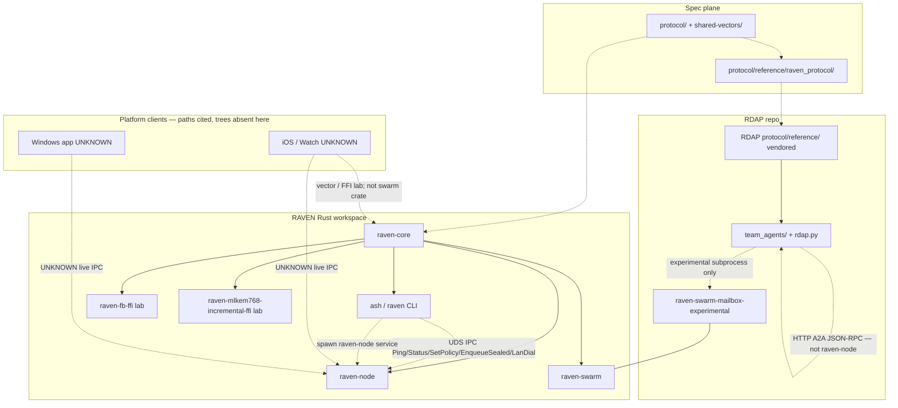

# Architecture Dependency Map — RAVEN + RDAP

**Status:** Architect draft (Sprint 0)  
**Owner:** #1 Principal Architect  
**Date:** 2026-09-04  
**Risk class of this document:** R0 (non-normative map). Changing an *allowed* edge in code is R2–R3 and needs an ADR.

This map records **who may depend on whom** among the shipping Rust crates, clients, and the RDAP companion repo. Claims cite a path in this checkout or in `Raven-ASHCO/raven-distributed-agent-protocol` (read via GitHub API on `main`). Anything not found is marked **UNKNOWN**.

Related: [`trust-boundaries.md`](trust-boundaries.md), [`undocumented-cross-layer-deps.md`](undocumented-cross-layer-deps.md), [`adr-framework.md`](adr-framework.md), [`risk-classes.md`](risk-classes.md), [`org-structure.md`](org-structure.md).

---

## 1. Evidence basis

| Source | What it grounds |
|--------|-----------------|
| `node/Cargo.toml` + each crate `Cargo.toml` | Allowed **crate** edges (compile-time) |
| `node/crates/*/src/**` module layout | Responsibility inventory |
| `docs/adr/0001`–`0003` | Canonical node language, internet transport, wire/crypto/IPC |
| `docs/SERVERLESS_MODEL.md`, `docs/SERVERLESS_FRIEND_MESH_BRIDGE_DESIGN.md` | Three planes (trust / delivery / bridge) |
| `docs/THREAT_MODEL.md`, `protocol/SPEC.md` | Invariants and production hold |
| `protocol/RAVEN_*`, `protocol/ATSAM_*` | Wire contracts |
| RDAP `README.md`, `team_agents/*`, `rdap.py` | Agent protocol surfaces (separate repo) |
| `.github/CODEOWNERS` | Team ownership of paths (does not define runtime deps) |

**Not in this RAVEN checkout (referenced, not invented):** `ios-native/`, `RAVEN-Windows/`, Go `Libp2pBridge`, FastAPI `server/`. CODEOWNERS, `CONTRIBUTING.md`, ADR 0001, and `docs/THREAT_MODEL.md` cite them. Treat mobile/Windows clients as **parallel implementations**, not crates in this workspace.

---

## 2. Layers

| Layer | What it is | Process / artifact |
|-------|------------|--------------------|
| **Spec** | Frozen wire + vectors | `protocol/`, `shared-vectors/`, `protocol/reference/raven_protocol/` |
| **raven-core** | Canonical RVN1 library | `node/crates/raven-core` rlib |
| **raven-node** | Always-on daemon (queue, LAN/TCP, bridge, UDS IPC) | `raven-node` binary |
| **raven-swarm** | libp2p host (Kad / optional mailbox / NAT experiments) | `raven-swarm` (+ experimental bins) |
| **ash / raven CLI** | Terminal client | `ash` / `raven` binaries (`node/crates/ash`) |
| **Lab FFI** | C ABI for iOS XCTest / Full Braid lab | `raven-fb-ffi`, `raven-mlkem768-incremental-ffi` |
| **Platform clients** | iOS/Watch, Windows | **UNKNOWN in this snapshot** — expected under `ios-native/`, `RAVEN-Windows/` |
| **RDAP** | A2A agent teams | Separate repo: `rdap*` launchers, `team_agents/`, vendored `protocol/reference/` |

Three product planes (do not collapse) — `docs/SERVERLESS_FRIEND_MESH_BRIDGE_DESIGN.md`:

1. **Trust / friendship** — QR/OOB, fingerprint, signed prekey, local contacts.
2. **Delivery** — opaque `RavenEnvelopeV1` store-carry-forward.
3. **Interop (Bridge)** — untrusted cross-transport forward of the **same** envelope.

RDAP is a **fourth companion plane** (delegated agent tasks). It is **not** yet on the production raven-node ATSAM path (RDAP `README.md` “Important integration gap”).

### 2.1 Founder priority (2026-09-04) — terminal first; three delivery pathways

**Priority:** most reliable **terminal** RAVEN (`ash` / `raven` + `raven-node`) on **Windows / macOS / Linux**. Landing the iOS/Watch (and other platform-client) trees is **deferred below** this. Those trees remain **UNKNOWN** in this checkout (U1); do not treat their absence as a Sprint 0 architecture blocker.

**Three delivery pathways** (how an already-trusted envelope moves). Keep these crisp. They are **not** a substitute for the three planes above: pathway choice lives in **Delivery** and **Bridge**; it must not become a friendship/directory, and Bridge must not hold conversation keys ([`docs/adr/0003-wire-crypto-identity-bridge-ipc.md`](../../adr/0003-wire-crypto-identity-bridge-ipc.md), [`docs/SERVERLESS_FRIEND_MESH_BRIDGE_DESIGN.md`](../../SERVERLESS_FRIEND_MESH_BRIDGE_DESIGN.md) “never collapse”).

| # | Pathway | What it is | What it is not | Cite |
|---|---------|------------|----------------|------|
| 1 | **Mesh relay** | BLE / nearby opaque forward of packed `RavenEnvelopeV1` (mock-BLE on headless node; GATT on flagged mobile when that tree lands) | A social graph; a plaintext radio; a place that learns contacts | ADR 0003 Bridge; `RAVEN_BLE_FRAMING_V1.md`; `MESH_PROTOCOL.md` (legacy JSON, deferred with iOS) |
| 2 | **Bridge** | Untrusted **cross-transport** store-and-forward of the **same** envelope (DTN gateway). No conversation keys on the bridge. | Friend introducer; contact-graph broker; decrypt/re-seal | ADR 0002 (relays never decrypt); ADR 0003; SERVERLESS plane 3; `RAVEN_BRIDGE_V1.md` |
| 3 | **Direct internet** | `InternetTransport` (V1 shipping: length-prefixed envelope, Ed25519 hello) and/or `raven-swarm` dial (target libp2p) | A Raven-operated inbox; transport auth as E2EE | ADR 0002; `RAVEN_TRANSPORT_INTERFACE_V1.md` |

Do not collapse: Trust/friendship stays local pin + OOB (plane 1). A mesh hop, a bridge hop, and an internet dial are interchangeable **carriers** of one opaque object (SPEC invariants 5–6) — not three products and not three identity systems.

---

## 3. Allowed dependency diagram

Solid arrows = **crate / library** dependency (Cargo).  
Dashed arrows = **process** coupling (spawn, UDS/named-pipe IPC, subprocess, HTTP).  
Dotted arrows = **spec / vector** conformance (no code import).



### 3.1 Allowed crate edges (observed)

| From | To | Evidence |
|------|----|----------|
| `raven-node` | `raven-core` | `node/crates/raven-node/Cargo.toml` `raven-core = { workspace = true }` |
| `raven-swarm` | `raven-core` | `node/crates/raven-swarm/Cargo.toml` |
| `ash` | `raven-core` | `node/crates/ash/Cargo.toml` |
| `raven-fb-ffi` | `raven-core` (`full-braid-lab`) | `node/crates/raven-fb-ffi/Cargo.toml` |
| `raven-mlkem768-incremental-ffi` | `raven-core` (`mlkem768-incremental-lab`) | `node/crates/raven-mlkem768-incremental-ffi/Cargo.toml` |

**No Cargo edge** from `raven-core` to node/swarm/ash. **No Cargo edge** from `ash` or `raven-node` to `raven-swarm`. **No Cargo edge** from any RAVEN crate to RDAP (Python).

### 3.2 Allowed process edges (observed)

| From | To | How | Evidence |
|------|----|-----|----------|
| `ash` | `raven-node` | Unix UDS `raven-node.sock`; ops in `IpcRequest` | `node/crates/raven-core/src/ipc.rs`, `raven-node/src/ipc_server.rs`, ADR 0003 |
| `ash` | `raven-node` | `Command::spawn` of sibling `raven-node` binary (`service` / lab send) | `node/crates/ash/src/ext.rs` `raven_node_bin()`, `ensure_mac_lan_daemon()` |
| RDAP `team_agents.mesh` | `raven-swarm-mailbox-experimental` | subprocess; feature `experimental-offline-mailbox`; flag `--allow-experimental-mailbox` | RDAP `team_agents/mesh.py` `BIN_NAME`, `build_swarm_bin()` |
| Platform install scripts | `raven-node` | launchd / systemd / Task Scheduler | ADR 0003; `node/scripts/install/WINDOWS_SERVICE.md` |

### 3.3 Intended-but-not-implemented edges

| From | To | Intent | Evidence that it is **not** live |
|------|----|--------|----------------------------------|
| RDAP task send | `raven-node` IPC `EnqueueSealed` | Production carrier: already-sealed RVN1 through the daemon | RDAP README: “does not submit or receive application payloads through the production `raven-node` ATSAM session actor” |
| RDAP identity | `raven-core::identity_store` | One user/device principal | RDAP README: “creates its own key under `.team/keys`”; `team_agents/raven_identity.py` `RavenIdentity.load_or_create` |
| Windows `ash` | named pipe `\\.\pipe\raven-node` | Same IPC framing as UDS | `WINDOWS_SERVICE.md`: “Windows ash falls back to `--send-stdin` spawn until named-pipe client lands” |
| iOS | `raven-node` | Clients are not the headless daemon | ADR 0001; **UNKNOWN** whether any iOS code talks UDS/IPC |

---

## 4. Forbidden edges

These are **architecture rules**. Some are already enforced by Cargo; others are process/policy (must not be added).

| # | Forbidden | Why | Enforcement today |
|---|-----------|-----|-------------------|
| F1 | `raven-core` importing `raven-node`, `raven-swarm`, `ash`, or RDAP | Core is the protocol library; dependents must not invert | Cargo: no such deps |
| F2 | Clients (`ash`, iOS, Windows, RDAP) importing `raven-swarm` internals (Kad behaviour, mailbox actor, connectivity) | Swarm is a transport host; clients use envelopes / IPC / experimental **binaries**, not libp2p types | Cargo: ash/node have no swarm dep. RDAP uses a **binary** name, not a Rust import |
| F3 | RDAP (or any agent) bypassing the ATSAM / indexed-session trust path for **production** content | Only an authenticated endpoint may recover plaintext (`protocol/SPEC.md` invariant 7; production held) | Policy + fail-closed origination in `raven-node` (`body_mode` default `atsam`). RDAP mailbox is explicitly **plaintext** and flag-gated |
| F4 | Putting private keys, seeds, plaintext, or recovery material on IPC | ADR 0003; `ipc.rs` refuses field names `seed` / `private_key` / `plaintext` / `recovery` | Decoder check; peer-cred UID match on UDS |
| F5 | Bridge / relay / store decrypting or holding conversation keys | ADR 0002, ADR 0003, `RAVEN_BRIDGE_V1.md` | Design + `bridge` APIs operate on packed envelopes. Live ATSAM session actor still production-disabled (`THREAT_MODEL.md`) |
| F6 | `raven-node` crate-depending on `raven-swarm` | Daemon V1 path is InternetTransport + LAN + mock-BLE (`SERVERLESS_MODEL.md`); swarm is a separate host | Cargo: no dep |
| F7 | FastAPI / central inbox as a mandatory DM or identity path | `docs/SERVERLESS_MODEL.md`, `docs/MIGRATION_SERVERLESS_V1.md` | Terminal path asserts `assert_no_silent_fastapi` (`messaging_path.rs`). `server/` **absent** from this checkout |
| F8 | Reinterpreting a user/device signature as an agent signature | `protocol/RAVEN_USER_OWNED_AGENT_RUNTIME_V1.md` §3 | Spec only; RDAP uses a **separate** Ed25519 key and `raven.a2a.delegation.v2` context — but that key is **not** the raven-node identity (gap) |
| F9 | Lab FFI (`raven-fb-ffi`, `raven-mlkem768-incremental-ffi`) in Release / App Store | Crate `compile_error!` on `not(debug_assertions)` | Compile-time |
| F10 | Default `raven-swarm` advertising mailbox or NAT protocols | Security hold comments in `raven-swarm/Cargo.toml` and `lib.rs` | Feature-gated bins only |
| F11 | RDAP treating `message_ciphertext` occupancy as E2EE | Mailbox adapter writes **signed JSON** into that field | RDAP README + `mesh.py` docstring |

---

## 5. Crate / path inventory

### 5.1 This workspace (RAVEN)

| Path | Responsibility (one line) |
|------|---------------------------|
| `node/crates/raven-core` | RVN1 identity, address, envelope, seal/ATSAM hooks, queues, bridge policy, IPC codec, LAN/internet helpers |
| `node/crates/raven-core/src/identity.rs` + `identity_store.rs` | Ed25519 identity + platform seed backends (Keychain / DPAPI / Secret Service / locked file) |
| `node/crates/raven-core/src/envelope.rs` | `RavenEnvelopeV1` pack/unpack (`RVN1`, 1 MiB ceiling) |
| `node/crates/raven-core/src/seal.rs` + `atsam_*` | Content seal classification; ATSAM KATs; production-disabled indexed session |
| `node/crates/raven-core/src/ipc.rs` | Versioned length-prefixed JSON IPC (`IPC_VERSION = 1`, 256 KiB) |
| `node/crates/raven-core/src/queue.rs` | Outgoing SQLite queue; delivery advances on signed ACK |
| `node/crates/raven-core/src/forward_queue.rs` | Bridge store-carry SQLite |
| `node/crates/raven-core/src/bridge.rs` | Opaque forward decisions; authenticated object digest |
| `node/crates/raven-core/src/internet.rs` | `RIH1` hello + `raven/internet/v1` framing |
| `node/crates/raven-core/src/store_object.rs` | `RSO1` custody + HMAC mailbox tags |
| `node/crates/raven-core/src/transport.rs` | Path selection among BLE / LAN / Internet / store |
| `node/crates/raven-core/src/message_router.rs` | Inbound envelope outcomes |
| `node/crates/raven-core/src/lan_*` | Noise XX LAN, RLB1 offers, PairInit OOB |
| `node/crates/raven-core/src/hybrid_ratchet_v2*` | Lab-only Full Braid (`full-braid-lab`) |
| `node/crates/raven-core/src/full_braid_durable_lab/` | Lab SQLCipher 4.17.0 profile (`full-braid-durable-lab`) |
| `node/crates/raven-node` | Daemon: TCP frames, bridge, UDS IPC, service |
| `node/crates/raven-node/src/ipc_server.rs` | UDS bind, `0600`, `SO_PEERCRED` / `getpeereid` |
| `node/crates/raven-node/src/bridge_run.rs` | LAN + mock-BLE opaque forward |
| `node/crates/raven-node/src/lan_direct.rs` | IPC `LanDial` Noise path |
| `node/crates/raven-node/src/corebluetooth_exp.rs` | Experimental macOS CoreBluetooth seam (feature `corebluetooth`) |
| `node/crates/raven-swarm` | libp2p TCP/QUIC + Noise + Yamux + Kad `/raven/kad/1.0.0` |
| `node/crates/raven-swarm/src/mailbox.rs` | Feature-gated `/raven/offline-mailbox/1.0.0` |
| `node/crates/raven-swarm/src/connectivity.rs` | Feature-gated AutoNAT / relay / DCUtR |
| `node/crates/ash` | Product CLI: contacts, policy, IPC client, spawn daemon |
| `node/crates/raven-fb-ffi` | Lab staticlib binder `raven_fb_*` for Swift XCTest |
| `node/crates/raven-mlkem768-incremental-ffi` | Lab C ABI for incremental ML-KEM-768 |
| `node/third_party/libsqlite3-sys-raven` | Audited SQLite amalgamation pin (workspace patch) |
| `node/third_party/raven-sqlcipher-profile-guard` | Fail-closed SQLCipher profile overrides |
| `node/third_party/secret-service-2.0.2-raven-noprompt` | Excluded Secret Service fork (not a default member) |
| `protocol/` | Normative RVN1 / ATSAM specs |
| `protocol/reference/raven_protocol/` | Python reference codecs + vector generator |
| `shared-vectors/rvn1/` | Cross-language fixtures |
| `docs/adr/0001`–`0003` | Accepted architecture ADRs |
| `node/adr/0001`–`0003` | **Duplicate copies** of the same ADRs (see undocumented deps) |

### 5.2 Clients (cited, not present)

| Path (cited) | Responsibility | Snapshot |
|--------------|----------------|----------|
| `ios-native/` | Apple client; BLE mesh; CryptoKit ATSAM; optional Go `Libp2pBridge` | **ABSENT** here; CODEOWNERS + `CONTRIBUTING.md` + `THREAT_MODEL.md` §3.4 cite it |
| `RAVEN-Windows/` | Windows client | **ABSENT** here; CODEOWNERS `/RAVEN-Windows/` |
| Watch | **UNKNOWN** — no path found in this checkout or RDAP tree |

### 5.3 RDAP (`github.com/Raven-ASHCO/raven-distributed-agent-protocol`)

Inspected `HEAD` tree on 2026-09-04. No `protocol/` *specs* beyond the vendored Python reference. Surfaces:

| Path | Responsibility (one line) |
|------|---------------------------|
| `rdap`, `rdap.py`, `rdap.cmd`, `rdap.ps1` | Operator wizard / launcher (`init`, `trust`, `start`, `ask`) |
| `team_agents/__init__.py` | Package `1.1.0`; bootstraps `protocol/reference` on `sys.path` |
| `team_agents/raven_identity.py` | Separate Ed25519 key; RVN1 address via reference codecs; delegation + HTTP request signatures; SQLite replay cache |
| `team_agents/client.py` | Signed A2A JSON-RPC client; peer pin = address + Ed25519 |
| `team_agents/server.py` | Starlette/uvicorn A2A server; Raven-signed RPC; per-peer task isolation |
| `team_agents/executor.py` | Task execution / tool dispatch |
| `team_agents/task_store.py` | Bounded A2A task history |
| `team_agents/mesh.py` | **Experimental plaintext** mailbox carrier via `raven-swarm-mailbox-experimental` |
| `team_agents/relay.py` | Git relay of signed tasks (allowlisted `.team` paths) |
| `team_agents/discovery.py` | mDNS TOFU discover (no Bearer) |
| `team_agents/config.py` | Node / LLM / task-store bounds |
| `team_agents/llm.py` | Provider-bound HTTPS LLM calls |
| `team_agents/memory.py` | Team memory under `.team` |
| `team_agents/tools.py` | Agent tools (`read_file` policy; shell off by default) |
| `team_agents/chat.py`, `ui.py` | Operator UX |
| `team_agents/selftest.py` | Functional suite (CI `selftest.yml`) |
| `protocol/reference/raven_protocol/` | Vendored copy of RAVEN Python reference (README: keep byte-identical) |

There is **no** `team_agents` or `rdap/` tree inside this RAVEN checkout.

---

## 6. How RDAP tasks are intended to reach raven-node

### 6.1 What exists today (RDAP `main`)

Three carriers, none of which is production raven-node:

| Carrier | Path | Confidentiality |
|---------|------|-----------------|
| Direct A2A HTTP | `rdap start` → `team_agents/server.py` (default port **9001** in README smoke) | Signed + peer-pinned; **not** Raven E2EE; HTTPS optional |
| Git relay | `team_agents/relay.py` + `rdap relay-setup` | Signed task/answer; repo ACL is the confidentiality story |
| Swarm mailbox | `team_agents/mesh.py` → `raven-swarm-mailbox-experimental` | **Disabled by default; plaintext** JSON in `message_ciphertext` |

README (verbatim intent): unifying RDAP with “the node identity/protected store and encrypted Raven carrier remains required before this can truthfully be called ‘A2A over production Raven Node.’”

`mesh.py` additionally:

- May `git clone --depth 1 https://github.com/Ahmadreza-Arezehgar/RAVEN.git` if `../../node/Cargo.toml` is missing (personal-account URL, not `Raven-ASHCO/RAVEN`).
- Builds `-p raven-swarm --features experimental-offline-mailbox --bin raven-swarm-mailbox-experimental`.
- Derives `store_tag = SHA-256(b"rdap-task:" + peer_address)[:16]` — **not** `raven_core::store_object::mailbox_tag` (`HMAC(K_route, "rvn1/mailbox" ‖ …)`).
- Sets `env_type=4` with comment “application/opaque”. Frozen registry says **4 = capabilities** (`protocol/RAVEN_ENVELOPE_V1.md` §3, `EnvType::Capabilities`).

### 6.2 What raven-node would accept (intended production seam)

`IpcRequest::EnqueueSealed` (`node/crates/raven-core/src/ipc.rs`):

- Client supplies **already-sealed** `RavenEnvelopeV1` (base64).
- “Daemon never seals from plaintext here.”
- Private keys MUST NOT appear on the socket.

That is the only documented IPC enqueue. There is **no** `IpcRequest` variant for “RDAP task”, “agent delegation”, or “unsealed JSON”.

`protocol/RAVEN_USER_OWNED_AGENT_RUNTIME_V1.md` defines a user-owned agent runtime (principals, capability verifier, human approval). It does **not** name RDAP, `team_agents`, or raven-node IPC. Status: **REQUIRED / NOT YET APPROVED**, production disabled.

### 6.3 Architect-intended path (not implemented — do not treat as shipping)

```
RDAP executor
  → (local) ATSAM / indexed-session seal of application bytes   # missing today
  → packed RavenEnvelopeV1
  → ash or rdap IPC client
  → raven-node EnqueueSealed (UDS / future named pipe)
  → raven-node forward queue / LAN / InternetTransport / bridge
  → peer raven-node
  → unseal only at ATSAM endpoint
  → RDAP verify delegation + replay cache
```

Until that lands, **RDAP MUST NOT** be described as riding production Raven Node. Track as a Raven↔RDAP gap for #4 / #14 / #2 (`ninety-day-outcomes.md` O6).

---

## 7. Invariants each layer protects

Aligned with `protocol/SPEC.md` (seven V1 + four mission invariants) and the three planes. **Production hold** (`SECURITY_ERRATA_RVN1_2026-08-13.md`, `THREAT_MODEL.md`) means several are design/test invariants, not release claims.

| Layer | Consistency | Identity | Transport | Storage |
|-------|-------------|----------|-----------|---------|
| **Spec / vectors** | Byte-exact RVN1; version bump ⇒ new tree | Address / fingerprint / device cert formulas | One envelope object on every carrier | Vector fixtures, not user data |
| **raven-core** | Strict parse; 1 MiB envelope; queue ID collision fail-closed | Seed never logged; `Identity` vs libp2p PeerId | Framing helpers; transport ≠ E2EE | SQLite schemas for queue / forward / history; SQLCipher **lab-only** |
| **raven-node** | Handler/frame/idle deadlines; 1 MiB TCP; 64 handlers | Loads identity via core store; does not mint a second user id | LAN/TCP + mock-BLE + InternetTransport; opaque bridge | `queue.sqlite`, `forward_queue.sqlite` under `--data-dir` |
| **raven-swarm** | Kad record verify (Ed25519); mailbox bounds when featured | Derives libp2p key from **domain-separated hash of Raven seed** (`raven/libp2p-peer-key/v1`) so PeerId ≠ address | Noise + TCP/QUIC; `/raven/kad/1.0.0` | Swarm data-dir; mailbox JSON when featured |
| **ash** | Messaging path label; no silent FastAPI | Same `identity_store` + `contacts.json` as node when `data_dir` shared | IPC client / spawn; not a packet forwarder | Reads/writes contacts, history, queues **directly** (not only via IPC) |
| **Clients (iOS/Win)** | Vector parity with core | Device Keychain / platform store (**UNKNOWN** here) | BLE GATT + optional Go bridge (cited) | Platform DBs (**UNKNOWN** here) |
| **RDAP** | Signed task/reply bind sender, recipient, id, kind, expiry; HTTP sig binds method/target/body | **Own** key in `.team/keys`; pin address↔pubkey | HTTP / Git / experimental mailbox | SQLite replay; bounded task store; **not** SQLCipher |

Layer-specific “must remain true”:

- **core:** no plaintext identities on the wire (`RAVEN_ENVELOPE_V1.md`); relays never see `K_route`.
- **node:** closing ash must not stop the daemon (ADR 0003); IPC peer UID = node euid.
- **swarm:** never decrypt sealed content; experimental protocols absent from default bin.
- **clients:** not the canonical daemon (ADR 0001); must not import swarm internals (F2).
- **RDAP:** model output is not authority (`RAVEN_USER_OWNED_AGENT_RUNTIME_V1.md`); unsigned RPC rejected by default.

---

## 8. Shared constants that couple layers

| Constant | Value | Homes |
|----------|-------|--------|
| Envelope magic / version | `RVN1` / `1` | `raven-core/src/envelope.rs`, `protocol/reference/.../envelope.py` |
| Max envelope | 1_048_576 | core `MAX_WIRE_ENVELOPE_BYTES`; RDAP `mesh.py` comment |
| Store magic | `RSO1` | `store_object.rs`; RDAP `mesh.py` |
| IPC version / max frame | `1` / 256 KiB | `ipc.rs`; RDAP default RPC body 256 KiB is a **parallel** bound, not the same codec |
| LAN listen | `0.0.0.0:7420` | `paths.rs` `DEFAULT_LAN_LISTEN`; ash `DEFAULT_LAN_PORT = 7420` |
| Mock BLE | `127.0.0.1:7421` | `paths.rs` |
| Internet hello | `RIH1`, proto `raven/internet/v1` | `internet.rs`, `RAVEN_TRANSPORT_INTERFACE_V1.md` |
| Kad protocol | `/raven/kad/1.0.0` | `raven-swarm/src/main.rs` |
| Mailbox protocol | `/raven/offline-mailbox/1.0.0` | `raven-swarm/src/mailbox.rs` |
| `env_type` 1–4 | message / ack / alias-gossip / **capabilities** | `RAVEN_ENVELOPE_V1.md`; **RDAP reuses 4 as opaque** (conflict) |

---

## 9. Explicit uncertainties

| ID | Item | Why UNKNOWN |
|----|------|-------------|
| U1 | iOS/Watch/Windows source trees | Not in this checkout; only CODEOWNERS / docs citations |
| U2 | Whether any client other than `ash` implements `IpcRequest` | No Swift/C# IPC client in this snapshot |
| U3 | Whether RDAP `protocol/reference` is byte-identical to RAVEN’s copy **right now** | README claims sync; no hash audit in this Sprint 0 pass |
| U4 | Live wiring of ATSAM indexed session / PairInit | Specs + core modules exist; `PRODUCTION_ENABLED` flags and `THREAT_MODEL.md` say production-disabled |
| U5 | Whether `node/adr/*` or `docs/adr/*` is treated as canonical in review | Both exist and match 0001–0003 titles; this map treats **`docs/adr/`** as the org path (see ADR framework) |
| U6 | Watch-specific FFI or BLE stack | No path found |
| U7 | How RDAP should bind to `RAVEN_USER_OWNED_AGENT_RUNTIME_V1` principals | Spec does not mention RDAP |

---

## 10. Owners (for changes to this map)

| Change | Primary | Second |
|--------|---------|--------|
| Allowed/forbidden crate edge | #1 | Architecture Board (#2, #4, #7) |
| IPC ops | #7 Core Runtime | #1 or #3 |
| Swarm protocols | #9 / #10 | #2 if wire |
| RDAP carrier onto raven-node | #4 Interop | #14 + #2; #17 if security |
| Crypto/ATSAM path | #5 | Security Board #17 — **no R3 self-merge** |
