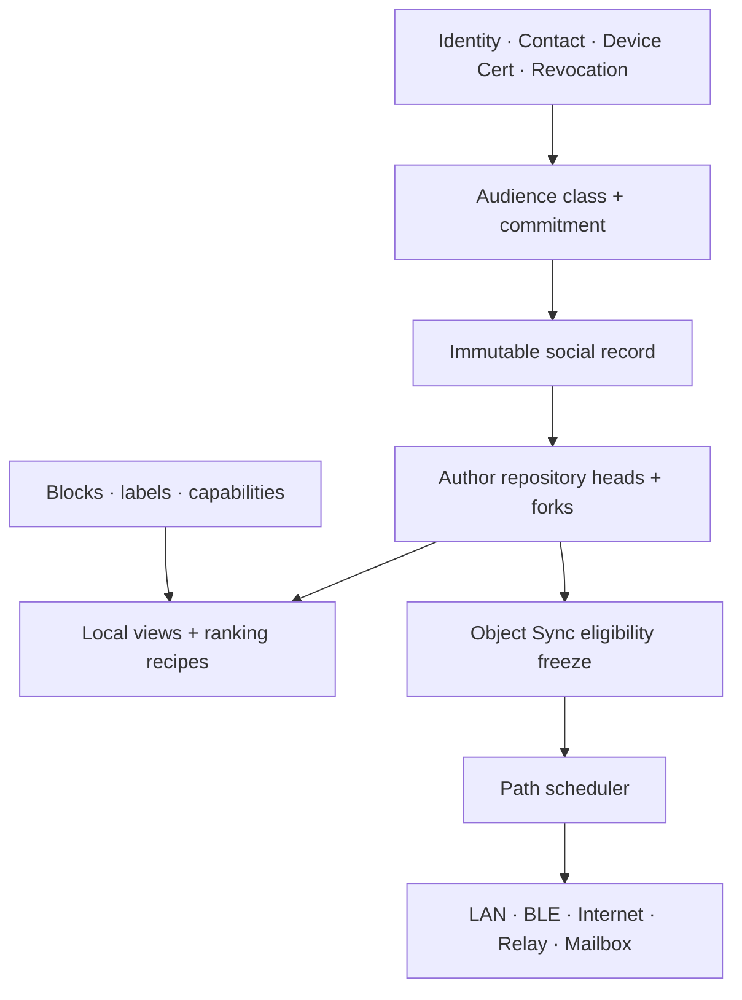

# RAVEN Sovereign Social Graph V1

**Version:** 1
**Document revision:** **14**
**Date:** 2026-08-21
**Status:** **REQUIRED / NOT YET APPROVED** — companion architecture under [`RAVEN_UNIFIED_SERVERLESS_ARCHITECTURE_V2.md`](RAVEN_UNIFIED_SERVERLESS_ARCHITECTURE_V2.md)
**Production:** **disabled** — this document authorizes **no** codec, database migration, carrier activation, live callsite, Release flag, or implementation plan
**Approval prerequisites:** Umbrella **Approved** (met); [`RAVEN_SOCIAL_REPOSITORY_AUTHORITY_V1.md`](RAVEN_SOCIAL_REPOSITORY_AUTHORITY_V1.md) **APPROVED** before repository/writer admission; Object Sync V1 **APPROVED** before any social-object inventory/sync claim; Device Revocation V1 **APPROVED** (met) before device-bound admission; ID Resolution V1 **APPROVED** before public short-ID discovery
**Unblocks (when APPROVED):** a separate byte-exact social-object wire companion; local social views; Object Sync eligibility filters for social classes
**Does not freeze:** wire layouts, magic values, KDF formulas, MLS group profiles, or persistence schemas — those require later APPROVED companions

**Umbrella invariants remain binding.** This companion MUST NOT weaken or override them. Any new public authenticated endpoint-record family requires either an umbrella revision or an APPROVED allowed-record companion before carriers admit it in production.

**Non-interference:** This document MUST NOT amend Full Braid Slice 3 Task 0B/0C, protected-anchor durability, SQLCipher profile work, or any production hold under those tracks.

---

## 0. Normative language and authorization boundary

The key words MUST, MUST NOT, SHOULD, and MAY are interpreted as in BCP 14 when capitalized.

### 0.1 What this document is

A **sovereign social graph** architecture: user-owned, locally ranked, private-by-default social records with stable application identity. Public records may themselves become umbrella-legal authenticated `endpoint_object_bytes`; private records travel **inside** separately sealed endpoint objects. Every carrier preserves the endpoint bytes it is given, while the local social DAG preserves the inner social-record identity.

### 0.2 What this document is not

| Forbidden | Rule |
|---|---|
| Code / production flag | No implementation or Release enablement is authorized |
| Blockchain / token / global ledger | Not required and MUST NOT be introduced as a dependency |
| Global firehose | No mandatory network-wide stream of all social activity |
| Central directory / central moderator | No Raven-operated authority that decides contacts, ranking, or speech |
| Custom group crypto | No Raven-authored group ratchet; private multi-party crypto requires the separate production-disabled [`RAVEN_SOVEREIGN_COMMUNITIES_V1.md`](RAVEN_SOVEREIGN_COMMUNITIES_V1.md) + pinned MLS track |
| Network erasure of public objects | Tombstones and local delete never claim remote physical erasure |
| Slice 3 / 0B / 0C changes | Out of scope |

### 0.3 Compatibility targets

| Companion | Compatibility rule |
|---|---|
| [`RAVEN_UNIFIED_SERVERLESS_ARCHITECTURE_V2.md`](RAVEN_UNIFIED_SERVERLESS_ARCHITECTURE_V2.md) | Three byte classes; Endpoint-only trust apply; carriers opaque; exact `object_digest`; local cancel-after-ACK |
| [`RAVEN_OBJECT_SYNC_V1.md`](RAVEN_OBJECT_SYNC_V1.md) | Social reconciliation uses `RVOS*` `carrier_control_bytes` only; eligibility is higher-layer; exact fetch re-checks contact/revocation/eligibility |
| [`RAVEN_PUBLIC_REPOSITORY_SYNC_V1.md`](RAVEN_PUBLIC_REPOSITORY_SYNC_V1.md) | Non-contact public follows use asymmetric signed-head/content-digest pull; no subscriber inventory, contact escalation, or mandatory firehose |
| [`RAVEN_DEVICE_REVOCATION_V1.md`](RAVEN_DEVICE_REVOCATION_V1.md) | Device-cert digest binding; sticky local deny; eventual partition semantics |
| [`RAVEN_ID_RESOLUTION_V1.md`](RAVEN_ID_RESOLUTION_V1.md) | Handles locate candidates; records authenticate only full canonical RavenAddress/device evidence; resolution never creates contact consent |
| [`RAVEN_SOVEREIGN_COMMUNITIES_V1.md`](RAVEN_SOVEREIGN_COMMUNITIES_V1.md) | Private circles use separate governance, user/device membership, MLS instances, and carrier-independent endpoint bytes; public records never imply private membership |
| Contact / Profile V1 | Local contact remains the durable trust root; profile DHT values remain non-graph |

---

## 1. Goals and threat model

### 1.1 Goals

| ID | Goal |
|---|---|
| G1 | Immutable signed (or session/group-authenticated) social records with stable digests |
| G2 | Per-author repository heads with honest fork / concurrent-branch detection |
| G3 | Successor and tombstone semantics without rewriting prior bytes |
| G4 | Audience classes: **public**, **contact**, **circle** (invite/capability scoped) |
| G5 | Private-by-default social graph (follow/block edges are local unless explicitly published) |
| G6 | Composable signed moderation labels chosen by the user |
| G7 | Local user-owned ranking recipes that never redefine authenticity |
| G8 | Attenuated community capabilities (delegation + expiry + narrower proofs) |
| G9 | Device-certificate and revocation binding on every trusted admission |
| G10 | Clear Object Sync eligibility rules and `eligibility_policy_digest` inputs |
| G11 | Explicit caps, shared-vector plan, and simulation requirements before approval |
| G12 | Multi-device authorship without a false global sequence or last-writer-wins authority |
| G13 | Public repository discovery and subscription without contact escalation or a mandatory global firehose |

### 1.2 Non-goals

- Instant global revoke, delete, or moderation enforcement under partition.
- A universal total order of all social events.
- Retroactive secrecy for removed circle members (when a future MLS profile exists).
- Inferring contact trust from co-location, shared circles, or public posts.
- Ranking-as-a-service or uploading private graphs for personalization.
- Custom group encryption algorithms authored by Raven.

### 1.3 Adversaries

| Adversary | Capabilities |
|---|---|
| Network | Drop, reorder, duplicate, inject carrier traffic; observe timing/size/endpoints |
| Relay / mailbox / bridge operator | Opaque custody only; MUST NOT parse social semantics or forge endpoint authenticity |
| Compromised device key | Mint objects until revocation is verified locally; cannot clear sticky revoke |
| Compromised identity key | Forge author signatures for that identity (out-of-band recovery) |
| Malicious authenticated peer | Offer forged inventories, spam digests, conflicting forks, abusive labels/capabilities |
| Curious contact | See only objects inside their audience; MUST NOT learn private follow graph by default |

### 1.4 Privacy honesty

E2EE and public signatures do **not** hide all metadata. Depending on carrier, observers may see timing, sizes, path choice, and proximity. Raven MUST NOT claim anonymity from VPN/Tor/relay alone, MUST NOT publish a global firehose, and MUST NOT promise remote erasure of public objects.

---

## 2. Layer model



| Layer | Owns | MUST NOT own |
|---|---|---|
| Identity / Revocation | Raven ID, device cert, local contact, sticky deny | Ranking or carrier reachability |
| Audience | Class + commitment binding who may decrypt/admit | Path selection |
| Social record | Exact immutable `social_record_bytes` and `social_digest` | Delivery state or carrier retry identity |
| Author repository | Heads, successors, tombstones, fork evidence | Global total order |
| Local view | Materialization, search, ranking recipes | Authenticity decisions |
| Policy | Blocks, label subscriptions, capability proofs | Remote deletion of replicas |
| Object Sync | Peer-eligible inventory reconciliation | Social parse of `RVOS*` symbols |
| Router / Carrier | Custody and attempts | Audience, moderation, endpoint ACK mint |

---

## 3. Immutable signed social records

### 3.1 Two non-interchangeable identities

Every logical social record has canonical immutable application bytes. The later wire companion must freeze this non-circular construction:

```text
social_signing_bytes = canonical record fields excluding the signature field
author_device_signature = Ed25519.Sign(device_signing_key, social_signing_bytes)
social_record_bytes = canonical_pack(social_signing_bytes, author_device_signature)
social_digest = SHA-256(social_record_bytes)
```

Every carrier admission still uses the umbrella identity:

```text
object_digest = SHA-256(endpoint_object_bytes)
```

The mapping is class-dependent:

| Form | Mapping |
|---|---|
| Public authenticated record | Only after an APPROVED allowed-record companion: `endpoint_object_bytes == social_record_bytes`, therefore `object_digest == social_digest` |
| Contact/private record | Exact `social_record_bytes` is plaintext payload inside a Session V2 sealed endpoint object. Each recipient device/session seal has its own `endpoint_object_bytes` and normally a different `object_digest` |
| Future private circle | Exact `social_record_bytes` is protected by an APPROVED MLS application-data profile; equality of ciphertext/object digests across members MUST NOT be assumed |

One logical record may therefore fan out into multiple independently sealed endpoint objects:

```text
one social_digest
  -> endpoint_object_bytes(device A), object_digest A
  -> endpoint_object_bytes(device B), object_digest B
  -> later exact retry for A reuses object_digest A
```

The two digests are never interchangeable:

- author DAG parents, successors, tombstones, reactions, labels, and local view dedup use `social_digest`;
- carrier queues, Object Sync inventories, exact retry, delivery state, and sealed ACKs use `object_digest`;
- a private `social_digest` MUST stay inside authenticated encryption and MUST NOT be copied into `carrier_record_bytes` or `carrier_control_bytes`;
- a sealed endpoint ACK acknowledges the exact `object_digest`, never every other seal carrying the same logical social record;
- after endpoint authentication/decryption, the Endpoint recomputes `social_digest` before social admission. A supplied inner digest is only a comparison value.

Carriers MAY wrap objects in `carrier_record_bytes`. Wrappers MUST preserve `endpoint_object_bytes` bitwise. `carrier_control_bytes` (including Object Sync) MUST NEVER be treated as social content.

### 3.2 Common authenticated fields (semantic; wire later)

Every social record MUST bind at least:

| Field | Meaning |
|---|---|
| `schema` / `kind` | Record family |
| `author_address` | Full canonical RavenAddress derived from the author identity key; never a short code, alias, or handle |
| `author_device_cert_digest` | Exact device-certificate digest used at mint |
| `author_writer_grant_digest` | Exact identity-signed repository writer grant authorizing that cert lineage and audience partition |
| `audience_class` | `public` \| `contact` \| `circle` |
| `audience_commitment` | Binding of audience parameters (see §5) |
| `repo_id` | Author repository this record belongs to |
| `author_device_id` | Exact opaque device identifier from the bound certificate; never a display label |
| `device_seq_u64` / `previous_device_social_digest?` | Per-certificate-lineage append position; sequence starts at 1 (see §4) |
| `repo_parent_social_digests[]` | Bounded causal dependencies in this repository; distinct from reply/content references |
| `created_at_ms` | Author-supplied advisory time |
| `payload` or `payload_digest` + content references | Content or content commitment; private confidentiality comes from the enclosing approved seal |
| Authentication | Author-device signature over exact canonical `social_signing_bytes`; the signature is then packed into `social_record_bytes`; outer approved session/group authentication is additionally required for sealed forms |

The author address/key and exact certificate lineage MUST verify before a trusted view mutates. Revocation and local block are then applied. A `public` record MAY be admitted from a non-contact under the bounded public-discovery policy, but it MUST NOT create a contact, unlock private inventory, or gain contact ranking automatically. `contact` and `circle` records require their class-specific consent/capability gates. Advisory timestamps MUST NOT decide authenticity.

### 3.3 Record families (semantic)

| Kind | Purpose | Mutation rule |
|---|---|---|
| `ProfileAssertion` | Public/contact profile facts | New assertion supersedes in views; old bytes remain if retained |
| `Post` | Root content | Immutable |
| `Reply` | References parent `social_digest` value(s) | Immutable |
| `Reaction` | Author reaction add/clear via successor | Immutable event; views reduce author-locally |
| `Edit` | Replacement proposal for a prior digest | Prior bytes not rewritten |
| `Tombstone` | Author (or authorized capability) asks views to hide a prior `social_digest` | No network erasure claim |
| `FollowStatement` | Explicit published follow/endorse (opt-in) | Immutable; absence reveals nothing |
| `ModerationLabel` | Signed annotation over a subject `social_digest` | Never rewrites subject |
| `CapabilityGrant` / `CapabilityInvocation` | Attenuated community authority | Valid only through proof chain + revoke policy |
| `MembershipHint` | Circle invite/membership **metadata** only | Not a substitute for future MLS commits |

Wire magic, lengths, and vectors are **out of scope** for this revision.

### 3.4 No destructive edits; no public erasure claim

```text
edit       => new record referencing prior social_digest
delete UI  => local hide and/or author Tombstone
public obj => authenticity ≠ retractability from hostile/offline replicas
```

Raven MUST communicate that once a public object has been replicated, physical erasure from other devices, backups, screenshots, or hostile peers is **not** guaranteed. Private ciphertext MAY become inaccessible after key/epoch retirement; that is not a proof of erasure.

---

## 4. Author repository: heads, successors, forks

### 4.1 Author repository and root descriptor

Each author maintains one or more **repositories** (`repo_id`). A repository is a signed append-oriented DAG of social records, not a blockchain and not a global ledger.

The production-disabled
[`RAVEN_SOCIAL_REPOSITORY_AUTHORITY_V1.md`](RAVEN_SOCIAL_REPOSITORY_AUTHORITY_V1.md)
draft freezes the V1 exact descriptor, audience policy, schema policy, writer
grant, and writer-retirement candidates.

The architecture consumes only `RVRA_AUTHORITY_ADMITTED` evidence for trusted
views. `RVRA_CODEC_CONFORMANT` authentic bytes from an unknown owner remain
bounded candidates and cannot create a contact, follow, feed row, notification,
inventory eligibility or ranking placement.

Its conceptual descriptor contains:

```text
descriptor_version
repo_id
repo_profile_id
repo_nonce[32]                 # CSPRNG genesis nonce; nonzero and unique per owner
owner_address
owner_identity_profile            # frozen-v1-key | continuity-v2
owner_identity_pub?               # required only for frozen-v1-key
owner_continuity_id?              # required only for continuity-v2
owner_operational_pub
owner_control_head_digest?        # required only for continuity-v2
genesis_descriptor_digest?
previous_descriptor_digest?
descriptor_sequence_u64
writer_policy_digest
audience_class
audience_partition_commitment
allowed_schema_families
created_at_ms
identity_signature
```

`repo_id` MUST be recomputable from a domain-separated digest of immutable genesis fields: exact repo/identity profile and version, stable owner authority, immutable audience class/partition commitment, and a 32-byte nonzero CSPRNG `repo_nonce`. For `frozen-v1-key`, stable owner authority is the exact RavenAddressV1 plus identity public key and the repo is not recovery-aware. For `continuity-v2`, it is the exact stable RavenAddressV2 plus `continuity_id`; the mutable operational key/control head is excluded from `repo_id` but required for every current authorization. The two derivations have distinct domains and wires; neither reinterprets the other.

RNG failure or nonce collision refuses repository creation; time, device ID, handle, source address, mutable operational key, control head, or writer policy is not a nonce substitute. The writer-policy root is deliberately excluded so writer grants can bind the already-defined `repo_id` without a circular construction.

A genesis descriptor has `descriptor_sequence_u64 = 1` and both `genesis_descriptor_digest` and `previous_descriptor_digest` absent. For every later descriptor, `genesis_descriptor_digest` is the exact digest of the verified sequence-1 descriptor, `previous_descriptor_digest` is the exact digest of sequence `n - 1`, and sequence increments by exactly one. The genesis digest is therefore never self-referential. A gap is incomplete evidence; it is not authority to skip. Exact replay is idempotent; lower sequence is stale; equal sequence with different exact bytes is authenticated conflict. Updating mutable policy MUST NOT change `repo_id`. A different owner/root, audience partition, profile, or genesis nonce produces a different repository and requires explicit local re-subscription.

Descriptor validity/expiry is a maximum authorization window, not proof that the verifier has the globally freshest descriptor. An expired greatest-known descriptor never causes fallback to an older descriptor. New automatic admission pauses until a valid successor or explicit repair is verified, while already admitted immutable records retain their historical admission evidence. Sources, caches, clocks, or announcement popularity cannot override the greatest locally pinned sequence/digest.

The descriptor binds an append-only writer-policy evidence root. Each authorized
lineage has an exact identity-signed writer grant binding at least `(repo_id,
repo_genesis_core_digest, audience partition, device_id, device_cert_digest,
grant_sequence, validity, previous writer-policy digest)`. The genesis-core
digest is `SHA-256(exact RVSG1 bytes)`; it is not descriptor 1's digest. This
direction lets grant 1 exist first and descriptor 1 activate it without a digest
cycle. Every record binds the exact grant digest. A descriptor's omission of an
old grant is never revocation; ending authority requires an explicit
identity-signed writer retirement and/or Device Revocation V1 evidence. A
retired grant is never reactivated by replay or omission. A later explicit grant
MAY re-authorize the same still-non-revoked certificate under a higher policy
sequence, but that exact certificate lineage continues at its next device
sequence rather than restarting at 1. Device Revocation remains sticky and wins
over every later writer grant.

New admissions apply the greatest locally verified retirement/revocation state. A record minted offline before retirement but first presented after the verifier learns retirement may be refused because advisory author time cannot prove pre-retirement minting. Already admitted records retain historical evidence and local presentation policy. As with device revocation, a partitioned verifier cannot claim globally fresh retirement knowledge.

A writer grant authorizes a valid owner device-certificate lineage to mint records; it does not make a device certificate an identity key. Under Continuity V2, the identity signature verifies under the operational key authorized by the exact bound control head/generation, and historical admission retains that control evidence. Recovery retires prior device lineages for new admission; a later record cannot use a stale operational key merely because its signature is mathematically valid.

Each repository is confined to one audience privacy partition. Its `audience_class` and `audience_partition_commitment` are immutable genesis fields and every record/grant must match them. A public repo, each contact space, and each circle therefore use distinct repositories; a device chain never links a public record to a private digest or one contact/circle to another. Changing that partition creates a new repository and requires explicit subscription/migration semantics.

A descriptor, repository follow, or valid public record MUST NOT create a contact, PairInit, private inventory eligibility, or a community capability.

```text
head_set(repo) = maximal records with no known successor in-repo
```

Local stores MUST retain a **head set**, not a single forced head. Offline multi-device authorship is expected.

### 4.2 Per-device writer chains and causal DAG

There is no author-global record sequence. Each admitted record occupies exactly one writer slot:

```text
writer_slot = (repo_id, author_device_id, author_device_cert_digest, device_seq_u64)
```

Rules:

1. A newly granted certificate lineage begins at `device_seq_u64 = 1` with no `previous_device_social_digest` and binds its exact writer-grant digest.
2. Every later record from that exact lineage increments by one and binds the immediately previous record's `social_digest`.
3. Exact replay in the same slot is idempotent. Different exact bytes in one slot are authenticated conflict; retain both as evidence and do not choose by arrival time, timestamp, or digest order.
4. A gap is incomplete history, not authority to skip. It may be buffered within caps or fetched, but it does not advance the verified writer head.
5. Different valid device-certificate lineages may mint concurrently. Their records are ordinary concurrent branches, not equivocation.
6. Certificate renewal or device replacement creates a new lineage beginning at sequence 1 only after an exact current identity-signed writer grant authorizes it. Reusing a retired/revoked `device_id`, key, cert, or grant lineage is denied by the greatest locally verified writer-policy and Device Revocation evidence.
7. `repo_parent_social_digests[]` expresses cross-lineage causal knowledge. It may merge branches by naming every head the author intends to subsume, but omission never deletes a locally retained head.

The design follows the useful one-writer property of append-only feeds while treating each certified device as its own writer. Raven does not invent a last-writer-wins rule across offline devices.

### 4.3 Successor semantics

A record MAY declare:

| Relation | Meaning |
|---|---|
| `parents[]` | Causal conversation parents (`social_digest` values) |
| `supersedes` | Same-repo predecessor `social_digest` this record replaces in views |
| `tombstones` | `social_digest` values this record asks views to hide |

Views apply successors locally. Replication retains exact historical bytes according to retention policy.

### 4.4 Fork detection

| Condition | Classification | Action |
|---|---|---|
| Identical `endpoint_object_bytes` | Idempotent transport duplicate | Dedup/retry by `object_digest` before decrypt |
| Identical `social_record_bytes` after authenticated decrypt | Idempotent logical duplicate | Dedup repository/view by `social_digest` |
| Different valid endpoint seals containing identical `social_record_bytes` | Same logical record delivered through distinct endpoint objects | Keep endpoint delivery state separate; admit social record once |
| Two valid records, same `repo_id`, incomparable under `supersedes`/`repo_parent_social_digests` | **Concurrent branch** | Keep both; head set = union; views mark fork |
| Same `writer_slot`, different exact bytes | **Authenticated conflict** | Retain both as evidence; terminalize that writer slot until explicit repair policy |
| Missing/mismatched writer grant or explicitly retired grant | **Unauthorized writer** | Reject before trusted-view mutation; omission alone never retires |
| Valid signature from revoked device cert | Deny | Sticky local revoke policy |
| Valid signature but audience commitment mismatch | Reject | No trusted-view mutation |

Forks are **honest concurrency** until a later merge/successor references both heads. Equivocation on a declared unique slot is conflict, not a silent overwrite.

### 4.5 Signed head announcements are hints, not authority

A later wire companion MUST freeze a bounded `RavenRepoHeadAnnouncementV1` carrying at least the exact `repo_id`, owner address, announcing device ID/cert digest, per-lineage `announcement_seq_u64`, bounded claimed head `social_digest` values, previous announcement digest, creation/expiry, and an author-device signature.

Head announcements are outside the repository DAG and are discovery hints:

- exact replay is idempotent; equal announcement sequence with different bytes is authenticated conflict;
- a higher announcement sequence binds the prior announcement from that lineage;
- valid announcements obtained from author devices, contacts, DHT-like stores, relays, or caches are unioned after verification;
- an announcement may reveal missing candidates but cannot prove completeness, delete a retained head, retract a record, or override a locally recomputed successor relation;
- transport arrival order, source popularity, source count, and relay preference never choose the canonical head;
- withheld or expired announcements reduce availability/freshness only. They do not invalidate already authenticated repository bytes.

Only a `public` partition announcement may be exposed through public stores/caches. A `contact` announcement must be carried inside an endpoint object sealed to that contact's authorized devices; a `circle` announcement requires the future approved group profile. Private head digests MUST NOT appear in public carrier wrappers or public Object Sync control.

This provides multiple-source public discovery without a Raven-operated global firehose. A follower recomputes actual heads only from verified repository records.

### 4.6 Ordering in views

Local views SHOULD order by a deterministic tuple:

```text
(causal_depth, locally_verified_receive_time, author_created_at_ms, social_digest)
```

No object may claim a universal chronological position across the whole network.

---

## 5. Audience classes

### 5.1 Classes

| Class | Security basis | Who may admit into a trusted view |
|---|---|---|
| **`public`** | Exact-byte public signature (umbrella public record form when authorized) | Any verifier of the signature + local policy |
| **`contact`** | Sealed under ATSAM Hybrid Ratchet / Session V2 with a **local contact** | Only devices of that contact relationship |
| **`circle`** | Invite/capability-scoped membership; sealed under future APPROVED MLS profile when private multi-party crypto is required | Only current authorized members |

Direct-session keys MUST NOT be reused as public-object keys. Public records MUST NOT be silently reclassified as private messages.

### 5.2 Audience commitment

`audience_commitment` is exactly `SHA-256(exact RVAP1 bytes)` from the authority
companion. RVAP1 binds its `audience_generation`, `stable_space_id`,
`schema_policy_digest`, and class-specific participants so an object cannot be
replayed into a wider audience:

| Class | Commitment binds (semantic) |
|---|---|
| `public` | `public` tag + generation + exact schema-policy digest + optional topic/space ID; zero participants |
| `contact` | Sorted full canonical participant RavenAddresses + stable logical `contact_space_id` + generation + exact schema-policy digest; never a session ID, recipient device ID, route, or carrier |
| `circle` | Circle id + epoch/capability generation when MLS/capability profile exists |

Widening audience requires a **new** object. Narrowing never rewrites old public bytes.

For `contact`, the inner commitment is stable across ratchet replacement, device fan-out, and carrier changes. The enclosing endpoint object's authenticated header/AAD MUST separately bind the exact Session V2 identifier, sender/recipient device lineages, direction, and recipient seal. A cross-session or cross-device ciphertext transplant therefore fails outer endpoint authentication, while a legitimate reseal of the same `social_record_bytes` keeps the same `social_digest`. Changing participants, `contact_space_id`, or `audience_generation` requires a new social record.

### 5.3 Continuity Circle (product surface)

A Continuity Circle is a user-visible space with one stable local identity and one object graph (direct thread, invite-only circle, or opt-in public channel). Path changes MUST NOT create a new thread, duplicate a post, reset delivery, or change audience.

Private multi-party confidentiality remains **deferred** to APPROVED Sovereign Communities + MLS profiles. Until those profiles exist, Raven MUST NOT ship a custom group ratchet and MUST NOT claim private-circle confidentiality beyond contact/direct sessions and local-only drafts.

---

## 6. Private-by-default social graph

### 6.1 Contact remains trust

Confirmed sessions, Bonjour names, relay observations, shared circles, mutual follows, and valid public posts MUST NOT silently become local contacts. Contact binding follows Contact Request / local UI Accept rules.

### 6.2 Follow / block edges

| Edge | Default | Publication |
|---|---|---|
| Follow | **Local only** | Optional explicit `FollowStatement` |
| Block | **Local only** | MUST NOT require a central moderator |
| Mute / hide | Local view policy | Never authenticity |

Raven MUST NOT publish a user's complete follow graph merely to obtain a feed. Absence of a `FollowStatement` reveals nothing about local follows.

### 6.3 Discovery

Short Raven ID search/paste remains forbidden until `RAVEN_ID_RESOLUTION_V1` is APPROVED. Public profile assertions remain non-graph (see Profile Record V1). No global firehose index is required for the sovereign graph to function.

Unknown public-content/person/repository search is governed by the separate
production-disabled
[`RAVEN_PRIVATE_DISCOVERY_V1.md`](RAVEN_PRIVATE_DISCOVERY_V1.md). It returns
candidate provenance only: it cannot create a graph edge, contact, repository
authority, public-subscription frontier, feed row, notification or ranking
decision. Local search over already admitted objects remains available without
a discovery network.

### 6.4 Identity labels never enter graph authority

Repository ownership, signatures, capabilities, blocks, and DAG edges bind the full canonical RavenAddress/identity key. A bare alias, Raven Code, namespaced handle, display name, or local petname may be shown only as presentation resolved through its own evidence. Changing or losing a handle never rekeys a repository, and two identities claiming one label are never merged. Following a public repository remains a local subscription; it does not accept that identity as a messaging contact.

### 6.5 Public repository discovery and subscription

A public repository MAY be discovered from an ID Resolution `PUBLIC_VIEW_ONLY` result, QR/file/NFC credential, verified contact gossip, a content-addressed store, an author device, or a relay/cache hint. Every source is untrusted for authority. The client MUST verify the full canonical owner address/key, exact repository descriptor chain, device certificate/revocation state, signed head announcement, and fetched record bytes.

Selecting **Follow** creates only a local `PublicRepoSubscription` keyed by `(owner_address, repo_id, exact_descriptor_digest)`. It MAY store bounded source hints and poll cursors. It MUST NOT:

- create or upgrade a messaging contact;
- authorize PairInit or a private Session V2 inventory;
- import a community capability;
- publish the user's follow edge unless the user separately signs a `FollowStatement`;
- treat source availability, follower count, relay count, or repeated copies as authenticity or ranking authority.

Public bytes may be fetched from multiple author devices/caches and unioned by exact digest. No source is authoritative for absence: a missing head, record, or tombstone is a withholding/availability result until verified successor evidence is obtained.

The current umbrella and Object Sync drafts assume already-authorized peer eligibility. Therefore **non-contact public Object Sync is not authorized by this document**. [`RAVEN_PUBLIC_REPOSITORY_SYNC_V1.md`](RAVEN_PUBLIC_REPOSITORY_SYNC_V1.md) defines the required asymmetric public-pull architecture and remains `NOT YET APPROVED`. Before shipping, its APPROVED public-subscription carrier/conformance profile MUST define a bounded `PUBLIC_READ(repo_id, descriptor_digest, schema_allow_list)` scope, requester privacy/rate limits, exact public-only fetch rules, and denial indistinguishability. That scope grants read eligibility for public endpoint records only; it is not contact trust, PairInit authority, a bearer community capability, or permission to enumerate private/contact objects. Until that profile is approved, public discovery may use only separately approved immutable-public-record fetch mechanisms and local imports.

---

## 7. Composable signed moderation labels

### 7.1 Labels as annotations

A `ModerationLabel` is a separately signed object binding at least:

```text
labeler_id || subject_social_digest || value || issued_at || expires_at || evidence_digest?
```

Labels NEVER rewrite the subject. Multiple labelers MAY disagree; clients preserve provenance.

### 7.2 Precedence

```text
local block / device revocation
  > circle membership / capability policy
  > user-selected signed label authorities
  > local heuristics
  > ranking recipe
```

No remote label may override a local block, authorize a contact, clear revocation, or decrypt ciphertext.

### 7.3 Reach versus speech

A valid author signature proves authorship, not a right to amplification. Clients MAY retain a valid object while hiding, warning, down-ranking, or refusing to forward it. Relays keep their own lawful admission policies but cannot forge author bytes.

Inspired by separately signed label systems (e.g. AT Protocol labels) without claiming wire compatibility.

---

## 8. Local user-owned ranking recipes

### 8.1 Contract

The canonical network data is the authenticated object graph. A feed is a **local materialized view**.

A ranking recipe:

- consumes only locally admitted objects and local preferences;
- MUST NOT affect object authenticity;
- MUST NOT alter Object Sync eligibility unless the user explicitly configures a **storage/subscription** policy distinct from ranking;
- binds an exact operator-registry digest and deterministic interpreter-profile
  digest so an unchanged recipe identifier cannot silently acquire new
  semantics;
- delegates equal-score ordering to the Attention Firewall's protected local
  PRF; bare digest, author timestamp, transport arrival, mirror count and source
  popularity are forbidden default tie-breaks;
- MUST expose inputs and a deterministic explanation for why an item appears.

Any public discovery, curator, labeler, stranger-admission, ranking, or notification path also conforms to [`RAVEN_ATTENTION_FIREWALL_V1.md`](RAVEN_ATTENTION_FIREWALL_V1.md). Social Graph may authenticate records without that companion, but it cannot claim bounded decentralized amplification or enable those product surfaces until the Attention Firewall is independently APPROVED. A signed object or label never purchases attention.

### 8.2 Built-in recipes (non-exhaustive)

| Recipe | Intent |
|---|---|
| Chronological | Causal topology, then protected local monotonic admission event; author time is advisory and transport arrival is not authority |
| Close contacts first | Local contact affinity |
| Circle-first | Prefer selected circle repos |
| Diversity-balanced | Cap per-author dominance |
| Low-bandwidth digest | Prefer small/text objects |
| Local-emergency priority | User-tagged priority sources |

### 8.3 Portability

Users MAY export ranking recipes. Exports MUST NOT include secrets, raw contacts, private graph edges, or hidden telemetry. Importing a recipe never grants authority.

A remote server MUST NOT be required to rank the local feed.

### 8.4 Archive boundary

An optional [`RAVEN_USER_OWNED_ARCHIVE_V1.md`](RAVEN_USER_OWNED_ARCHIVE_V1.md) snapshot may preserve exact admitted social records, local subscriptions, user-authored drafts, and selected non-secret preferences under an independent archive key. It is a private historical copy, not a repository source, mirror, feed service, contact, capability, or publication action.

Restore never republishes records, follows authors, invokes capabilities, downloads referenced media, or assigns attention. Public/private records retain their exact original provenance; contact/follow pins return as historical local state subject to current identity/revocation and explicit user confirmation. Local dwell/read history, hidden graph signals, and ranking telemetry are excluded by default.

---

## 9. Attenuated community capabilities

### 9.1 Model

Community administration uses attenuated signed capabilities rather than global admin accounts. Semantics MAY follow the UCAN pattern (delegation, invocation, attenuation, expiry, revocation) but MUST define Raven-canonical bytes before any interoperability claim.

### 9.2 Example abilities

- invite one member before a deadline;
- publish to one circle/channel;
- issue one class of moderation label;
- pin an object for a bounded period;
- operate an opaque relay under a quota;
- delegate a strictly narrower ability.

### 9.3 Rules

| Rule | Requirement |
|---|---|
| Attenuation | Delegate authority ⊆ parent proof |
| Expiry | Every grant/invocation time-bounded |
| Revocation | Eventual under partition; never presented as instant global removal |
| Wildcard | SHOULD be absent from normal UI |
| Binding | Proofs bind full canonical RavenAddress + device cert digest + audience/circle id |

Capabilities NEVER replace device revocation or local block.

### 9.4 Invocation and replay boundary

Normal community grants are holder-bound, not freely transferable bearer strings. A later wire must bind every invocation to the exact invoker identity/device, parent proof-chain digest, resource, ability, audience/circle generation, expiry, and a unique invocation ID. The receiver verifies the complete attenuation chain and records bounded replay evidence before applying a one-shot mutation. Copying a proof to another identity/device, widening a resource, replaying an accepted invocation, or omitting a parent fails closed.

Offline delegation may be accepted within its frozen validity and revocation-staleness policy, but Raven must label the eventual-revocation limitation. A namespace handle, public follow, relay role, or moderation label is never itself a capability.

---

## 10. Device-certificate and revocation binding

### 10.1 Mint binding

Every trusted social mint MUST bind `author_device_cert_digest` to the exact device certificate used. Verifiers MUST reject records whose cert digest is not covered by a currently accepted certificate for that identity, subject to revocation.

### 10.2 Apply binding

Before trusted-view mutation or Object Sync exact admission of a social record,
two commit domains remain distinct:

1. authenticate exact `endpoint_object_bytes`; for sealed forms, decrypt only on
   a candidate endpoint state, then atomically commit the endpoint receipt/inbox,
   ratchet promotion, and exact ACK intent before any ACK can be released;
2. strict-parse exact `social_record_bytes`, reconstruct exact `social_signing_bytes`, recompute `social_digest`, and verify the author-device signature, canonical address, exact certificate digest, certificate signature, and lineage;
3. verify the exact identity-signed writer grant, repository/audience/device/cert binding, policy-chain continuity, and greatest locally known retirement state;
4. verify the audience commitment and class gate:
   - `public`: approved public schema plus bounded unknown-author policy; no contact is required or created;
   - `contact`: an existing accepted local contact plus the stable participant/`contact_space_id`/generation commitment; the already-authenticated outer endpoint object separately proves the exact session, direction, and device seal;
   - `circle`: exact capability/membership epoch plus an APPROVED group profile;
5. apply [`RAVEN_DEVICE_REVOCATION_V1.md`](RAVEN_DEVICE_REVOCATION_V1.md) sticky deny and local block policy for the author lineage;
6. persist the class-specific admission evidence and social record atomically with the intended view mutation;
7. only after the social transaction commits may the record enter search,
   ranking, notification, forwarding, or public-source eligibility.

For a sealed contact/circle object, the endpoint ACK acknowledges durable receipt
of that exact `object_digest`, not semantic endorsement by the social layer. An
authenticated but unsupported/invalid social payload is durably classified and
bounded after the endpoint transaction; it does not roll back or reuse the
ratchet key and does not gain a social side effect. For public pull/import there
is no endpoint delivery ACK: transfer/custody completion is not social admission.

A signed public post from a non-contact is public discovery, not contact consent. It MUST NOT create a contact, make private objects inventory-eligible, authorize PairInit, or inherit close-contact ranking without an explicit local action.

### 10.3 Partition honesty

Revocation and capability revocation are **eventual**. A partitioned verifier that has not received a revoke may still accept objects from a still-unexpired certificate until it learns otherwise. Product UI MUST NOT claim instant global device removal.

### 10.4 Historical admission evidence

`created_at_ms` is author-advisory and cannot prove that a record predates compromise, writer retirement, or revocation. For every accepted public record, the local store therefore retains bounded admission evidence: exact cert and writer-grant digests, greatest writer-policy/retirement state, first verified local monotonic event, current revocation-state digest/generation, `social_digest`, and enclosing `object_digest`. Exact replay may reuse that evidence only if anti-rollback storage proves it is the same admitted record.

Learning a later lineage revoke denies new admissions immediately. Whether already-admitted historical records remain visible, receive a warning, or are hidden is an explicit local policy; Raven cannot cryptographically backdate the revoke without a future trusted timestamp/transparency profile. Stored bytes and conflict/revocation evidence are not silently rewritten.

---

## 11. Object Sync eligibility

### 11.1 Role of Object Sync

Social reconciliation MUST use approved [`RAVEN_OBJECT_SYNC_V1.md`](RAVEN_OBJECT_SYNC_V1.md) over an already authenticated carrier session. Social semantics MUST NOT enter Rateless IBLT symbols, page manifests, or other `carrier_control_bytes`. Exact objects are parsed only after exact fetch and trust admission.

For a local contact/circle, eligibility is derived from the existing contact/capability relation. For a non-contact public subscription, Object Sync MUST remain disabled until the separate public-read profile in §6.5 is APPROVED and registered by the umbrella and Carrier Conformance companions.

### 11.2 Eligibility set construction

Before inventory freeze for a peer `(remote_raven_id, remote_device_id)`:

```text
eligible_endpoint_objects = { object_digest |
    exact endpoint_object_bytes locally retained
    AND audience admits peer
    AND not blocked
    AND author device not sticky-denied (when required for that class)
    AND not expired under local retention
    AND not local-only draft / ranking / search / label-subscription state
    AND peer holds required circle capability/epoch when class=circle
}
```

For private records, this set contains the exact recipient/session-specific sealed endpoint object—not the inner `social_digest` and not a newly resealed substitute. If another device needs the same logical record, the Endpoint must already have minted and durably queued a separately authorized seal for that device; Object Sync cannot mint it.

`eligibility_policy_digest` (Object Sync §7) MUST bind the exact filter bytes used for that snapshot (class allow-list, contact/circle predicates, retention, block set digest, capability policy digest). It is not an authorization token.

### 11.3 Exact fetch re-check

Per Object Sync: after exact `carrier_record_bytes` arrive, the receiver recomputes digests and MUST re-check contact, revocation, and eligibility before durable social admission. Deleted/expired/ineligible objects are indistinguishably unavailable at fetch.

### 11.4 What must never be eligible

- private follow/block edges;
- ranking recipes and explanations;
- search indexes;
- label-authority subscription preferences;
- local drafts;
- objects whose audience commitment excludes the peer;
- Object Sync control frames themselves.

---

## 12. Caps (architecture ceilings)

These are architecture ceilings for later wire companions. Carriers and Object Sync effective caps may only **tighten**.

| Cap | Default ceiling | Absolute max |
|---|---|---|
| Single `social_record_bytes` | 256 KiB text-oriented | ≤24 MiB and never above the enclosing approved endpoint-object ceiling |
| Embedded media reference per object | 32 content digests | 256 |
| Parents / supersedes references | 16 | 64 |
| Concurrent heads retained per repo | 32 | 256 |
| Device writer lineages retained per repo | 16 | 64 |
| Claimed heads per signed announcement | 32 | 256 |
| Source hints retained per public subscription | 8 | 32 |
| Labels retained per subject | 64 | 1024 |
| Capability proof chain depth | 8 | 16 |
| Peer-eligible social items per Object Sync snapshot | Object Sync `max_eligible_items` | Object Sync absolute |
| Unknown-sender durable social intake / day | 8 objects | 64 |
| Process-global pending social verify queue | 256 | 4096 |

All parsers MUST enforce limits **before** allocation. Unknown senders MUST NOT evict trusted pending work.

---

## 13. Shared vectors and simulations (approval gates)

### 13.1 Shared-vector plan (when a wire companion exists)

| Vector class | Must prove |
|---|---|
| Digest / signing | Cross-language `social_digest`, signature verify, and public equality versus private inequality with `object_digest` |
| Audience commitment | Same inputs → same commitment; widen fails |
| Contact continuity | Session/device reseal preserves `social_digest`; outer transplant fails; logical audience generation change produces a new digest |
| Device writer chain | Per-lineage sequence/gap/replay/conflict; two devices at sequence 1 are concurrent, not conflicting |
| Writer authority | Grant/retirement chain, exact record binding, omission-no-revoke, re-grant continuation, sticky device revoke precedence |
| Repo descriptor / head | Root substitution, descriptor rollback/equivocation, announcement union/withholding/conflict |
| Successor / tombstone | View reduction without byte rewrite |
| Fork | Concurrent heads union; unique-slot conflict evidence |
| Label precedence | Block > label; label cannot clear revoke |
| Capability attenuation | Broader-than-parent proof rejected |
| Revocation binding | Revoked device cert cannot admit |
| Eligibility | Identical policy bytes → identical `eligibility_policy_digest` |
| Negatives | Truncation, trailing bytes, audience downgrade, cross-session transplant |

### 13.2 Simulations

Before APPROVED status for any social wire companion:

| Simulation | Requirement |
|---|---|
| Partition + multi-device | Two author devices offline; both branches survive; deterministic view merge |
| Public subscription partition | Three independent sources with overlapping/withheld announcements; verified union converges without creating contact or trusting source count |
| Path continuity | Same exact endpoint object/`object_digest` across multiple carrier attempts to one recipient; stable inner `social_digest` across separately authorized recipient seals; sealed ACK only after durable endpoint receipt/ratchet/ACK-intent commit, independent of later social-view eligibility |
| Spam / malicious inventory | Object Sync abuse caps; social eligibility excludes junk |
| Label war | Conflicting labelers; local policy stable; no subject rewrite |
| Capability expiry | Expired grants stop invocations; no silent renewal |
| 1,000-node churn | Compatible with [`RAVEN_NETWORK_SIMULATION_1000_V1.md`](RAVEN_NETWORK_SIMULATION_1000_V1.md) class budgets where applicable |

In-memory-only fixtures are insufficient for product continuity claims.

---

## 14. Threat residuals and explicit non-claims

| Claim Raven MUST NOT make | Honest residual |
|---|---|
| “Deleted everywhere” | Tombstone + local delete only |
| “Instant revoke worldwide” | Eventual revoke under partition |
| “Anonymous because relay” | Metadata still visible |
| “Followers are private and also publicly ranked by us” | Private follows stay local; public statements are explicit |
| “Labels are law” | Labels are user-selected policy inputs |
| “Custom secure groups without MLS” | Forbidden; MLS deferred |

---

## 15. Delivery sequence (non-normative)

1. **Foundation** — Session V2, ID Resolution, Object Sync, Public Repository Sync, Carrier Conformance APPROVED as applicable; umbrella physical gates.
2. **Continuity Direct** — contact-audience social records only; multi-path exact ACK.
3. **Local social graph** — posts/replies/edits/reactions/tombstones + ranking recipes; public opt-in only.
4. **Composable moderation / capabilities** — labels + attenuated grants.
5. **Private circles** — only after [`RAVEN_SOVEREIGN_COMMUNITIES_V1.md`](RAVEN_SOVEREIGN_COMMUNITIES_V1.md), its pinned MLS profile, and required carrier/durability companions are APPROVED.

Full Braid Slice 3 Task 0B/0C proceeds on its own ledger and is not gated by this draft, nor amended by it.

---

## 16. Production holds

Production / Release social features MUST remain disabled until **all** of:

1. this document is **APPROVED**;
2. a byte-exact social-object wire companion is **APPROVED** with three-language vectors for `social_digest` versus `object_digest`, per-recipient sealing, exact replay, and public-record equality;
3. the umbrella companion matrix/allowed-public-record policy explicitly registers the social wire profile through protocol-owner re-approval;
4. Object Sync V1 is **APPROVED** and eligibility filters are conformance-tested;
5. umbrella §9–§10 holds for every enabled carrier;
6. independent security/privacy review has no open P0/P1 for the shipping surface;
7. UI distinguishes custody vs delivered, tombstone vs erasure, block vs revoke, audience classes;
8. public unknown-author admission is bounded and proven unable to create contacts, sessions, private inventory eligibility, or implicit capabilities;
9. historical certificate/revocation admission evidence and rollback recovery pass crash tests;
10. public repository descriptor/head chains, exact writer grants/retirements, per-device writer slots, and public-subscription no-escalation pass three-language vectors and partition simulations;
11. Public Repository Sync V1 and its public-read carrier/conformance profile are APPROVED before any non-contact network sync path;
12. Attention Firewall V1 is APPROVED before public discovery/ranking/labeler/curator/stranger-notification paths are enabled;
13. Private Discovery V1 is APPROVED before any unknown public search, shard,
    remote query or mesh discovery surface is enabled; QR/import of an exact
    already-known credential remains separately gated;
14. Identity Continuity V2 and its historical-control admission rules are APPROVED before any V2-owned repository claims key rotation/recovery without changing `repo_id`;
15. if social archive/restore ships, User-Owned Archive V1 is APPROVED and restore proves no implicit publication/follow/contact/capability/network effect;
16. Sovereign Communities V1 and its pinned MLS profile are APPROVED before any private circle or community group surface ships;
17. no lab/test flag compiles into an enabled Release path.

Automated green alone MUST NOT enable production.

---

## 17. Open decisions before approval

1. Exact canonical `social_record_bytes`, `social_digest`, magics, signatures, and size limits per family.
2. Whether each public social family needs an umbrella revision or one allowed-record companion.
3. Per-recipient/device seal fan-out, inner-record signature, ACK aggregation, and local delivery-view semantics.
4. Approval/vectors/durability for the drafted repository descriptor and writer
   grant/retirement chain; exact head-announcement, conflict-repair, and
   concurrent-head compaction bytes.
5. Historical cert expiry/revocation presentation without pretending advisory timestamps are trusted.
6. Media chunking and retention vs Object Sync ceilings.
7. Label conflict, appeal, and evidence privacy.
8. Capability proof encoding, holder binding, replay store, and partition revocation UX.
9. Exact public-read carrier profile, anti-abuse/privacy policy, cache retention, and source-hint discovery without a mandatory global index.
10. MLS provider choice and PQ transition (separate track).

---

## 18. Research foundations (informative only)

These inform design choices and are **not** Raven wire specifications:

- [AT Protocol Repository](https://atproto.com/specs/repository) / [Labels](https://atproto.com/specs/label) — self-certifying public records; composable labels
- [AT Protocol Sync](https://atproto.com/specs/sync) — signed repository snapshots/diffs can be mirrored; transport sources are not record authority
- [Secure Scuttlebutt Protocol Guide](https://ssbc.github.io/scuttlebutt-protocol-guide/) — one-writer signed append-only feed sequence and previous-hash chaining; peer replication
- [Nostr NIP-01](https://github.com/nostr-protocol/nips/blob/master/01.md) — signed content-addressed events replicated across user-selected relays; relay arrival is not author authority
- [Briar — How it works](https://briarproject.org/how-it-works/) — multi-path encrypted sync without a central server
- [UCAN specification](https://github.com/ucan-wg/spec) — attenuated capabilities
- [RFC 9420 MLS](https://www.rfc-editor.org/rfc/rfc9420.html) — future private multi-party crypto (deferred)
- Object Sync rateless reconciliation — [`RAVEN_OBJECT_SYNC_V1.md`](RAVEN_OBJECT_SYNC_V1.md)

---

## 19. Revision history

| Revision | Date | Change |
|---|---|---|
| 1 | 2026-08-21 | Initial research draft (Continuity Circle framing) |
| 2 | 2026-08-21 | REQUIRED / NOT YET APPROVED companion rewrite: immutable records, author heads/forks, successor/tombstone, audience classes, private-by-default graph, labels, ranking recipes, attenuated capabilities, cert/revocation binding, Object Sync eligibility, threat model/caps/vectors/simulations; explicit forbids (no blockchain, firehose, central moderator, custom group crypto, public erasure claims, 0B/0C changes) |
| 3 | 2026-08-21 | Cross-layer hardening: separate stable `social_digest` from per-seal `object_digest`; freeze private fan-out/ACK boundaries; public non-contact admission without contact escalation; canonical-address-only authority; holder-bound capability replay rules; historical cert/revocation evidence and new production gates |
| 4 | 2026-08-21 | Repository/subscription hardening: stable logical contact audience independent of sessions/devices; per-device certificate-lineage sequences and concurrent DAG branches; identity-authorized repo descriptors; signed multi-source head hints; bounded non-contact public subscription with explicit no-escalation and public-read conformance hold |
| 5 | 2026-08-21 | Writer-authority hardening: every record binds an exact identity-signed repo writer grant; descriptor omission cannot revoke; explicit retirement/revocation is eventual; grant/policy lineage joins per-device sequencing and audience-partition isolation |
| 6 | 2026-08-21 | Repository-root hardening: non-circular nonce-derived `repo_id`; exact sequence-1 genesis and successor-digest rules; descriptor expiry is an authorization ceiling rather than global-freshness proof; stale sources cannot roll back the greatest local pin |
| 7 | 2026-08-21 | Attention-plane boundary: public discovery, labels, curators, ranking, and notifications require the separate local-first Attention Firewall; signed/authentic social bytes never imply amplification |
| 8 | 2026-08-21 | Identity-continuity boundary: frozen V1 repos remain key-bound; V2 repo IDs bind stable continuity authority rather than mutable operational keys; every V2 writer authorization retains exact control-head/generation evidence and recovery retires stale lineages |
| 9 | 2026-08-21 | User-owned archive boundary: social records/subscriptions may be preserved only as independently encrypted historical state; restore cannot publish, follow, create contacts/capabilities, fetch media, or import private attention behavior by default |
| 10 | 2026-08-21 | Sovereign-community boundary: private circles now depend on explicit governance/user-device membership plus a pinned MLS profile; public social records never imply private membership and no custom/shared-key group crypto may substitute |
| 11 | 2026-08-21 | ACK transaction correction: endpoint receipt/ratchet/ACK intent commits before sealed ACK release, while social admission/view eligibility remains a separate candidate transaction; unsupported authentic content cannot force ratchet rollback or treat an ACK as semantic endorsement. |
| 12 | 2026-08-21 | Repository-authority reconciliation: linked the exact production-disabled authority draft, replaced the ambiguous descriptor/genesis writer binding with non-circular `repo_genesis_core_digest`, and mapped the semantic audience commitment to exact `SHA-256(RVAP1)` bytes. Grant 1 can now be computed before descriptor 1 activates it. |
| 13 | 2026-08-21 | Attention-ranking reconciliation: recipe semantics now bind exact operator/interpreter profiles, equal scores use the protected device-local Attention PRF, and the chronological recipe uses causal topology plus a local monotonic admission event rather than author timestamps or transport arrival authority. |
| 14 | 2026-08-21 | Private-discovery boundary: unknown public search now has a separate candidate-only companion; it cannot create graph/contact/follow/view/rank authority, while local search and exact known-credential import remain distinct paths. |
