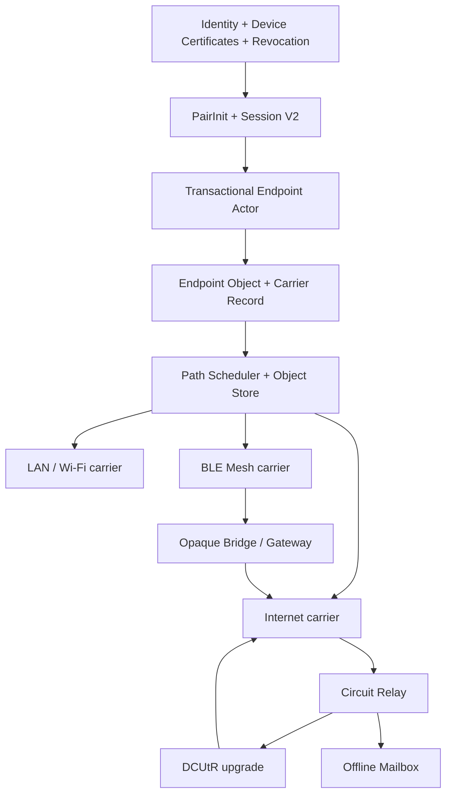
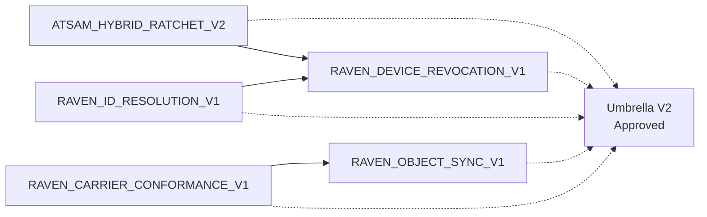

# RAVEN Unified Serverless Architecture V2

**Version:** 2 (`rvn2` architecture family; RVN1 wire objects remain unless a companion upgrades them)  
**Document revision:** **2** (public authenticated endpoint records)  
**Status:** **Approved** (binding umbrella; **re-approved** 2026-08-16 with Document revision 2); **production disabled** until every security companion listed in §8 is **APPROVED**, exit criteria in §9 are met, and each carrier’s corresponding physical gates in §10.2 pass  
**Audience:** protocol authors, Rust/`raven-core`, Swift, Terminal, and future ports  
**Does not freeze:** KDF formulas, ratchet headers, revocation/resolution wire layouts, sync-frame codecs, or persistence schemas — those live only in companions (§8)

**Product boundary:** [`RAVEN_MESSAGING_PRODUCT_BOUNDARY_V1.md`](RAVEN_MESSAGING_PRODUCT_BOUNDARY_V1.md)
is binding. Raven is a private messaging application. Public feed, follower,
post, engagement-ranking and public social-repository drafts are abandoned
experiments and cannot become companions, endpoint-object classes, approval
prerequisites, migration targets, live callsites or Release surfaces.

This document freezes the **shared messaging core**: Endpoint, Object, Carrier, and Router boundaries. Wi‑Fi / LAN, BLE mesh, Internet (libp2p), Circuit Relay, mailbox, and opaque bridges are **carriers of the same immutable `endpoint_object_bytes`** — either a **sealed** RavenEnvelope/successor payload or an umbrella-allowed **immutable authenticated public endpoint record**. They MUST NOT decrypt sealed session payloads, mint endpoint ACKs, or advance delivery to Delivered. For public records, carriers MUST remain opaque to trust semantics; only the Endpoint / Identity layer verifies and applies them.

**Umbrella vs companions:** Companions MAY refine wires, KDFs, and carrier layouts within this architecture. A companion MUST NOT weaken or override an invariant in this document. Any change to umbrella invariants requires a **revision of this umbrella**, not a silent companion override.

**Relationship to A2 / indexed-session lab work:** Phase A2 (Swift↔Terminal LAN Noise XX + RLB1 + lab PairInit path) is an **experimental LAN carrier exercise**, not the V2 foundation. [`ATSAM/indexed-session/v1`](ATSAM_INDEXED_SESSION_PROFILE_V1.md) remains a **lab / interoperability profile under production hold**. PairInit V1 is retained for compatibility; Session V2 is specified in a companion.

---

## 1. Layering



| Layer | Responsibility | Forbidden |
|-------|----------------|-----------|
| **Identity / Contact / Revocation** | Raven ID binding, local contact trust, device certificates; verify/apply signed **public** revocation records | Treating Bonjour/AutoNAT/relay as authentication; letting carriers interpret revoke trust |
| **Session** | PairInit (V1 retained) + Session V2 ratchet profile | Letting carriers invent session state |
| **Endpoint Actor** | Interpret message / PairInit / ACK; verify/apply approved public endpoint records; transactional crash recovery; sealed ACK mint | Running under carrier I/O locks; decrypting sealed payloads on behalf of relays |
| **Object** | Immutable `endpoint_object_bytes` + digest (sealed envelope **or** umbrella-allowed public authenticated record); optional hop-local `carrier_record_bytes` | Mutating endpoint object bytes after mint/seal; treating wrappers or controls as the digest root |
| **Router / Path Scheduler** | Admit endpoint objects to one or more carriers; inventory; schedule; local cancel after valid ACK | Claiming global delivery from hop custody |
| **Carrier** | Move endpoint objects (via records as needed); hop custody; parse **carrier-control** only | Decrypt session/plaintext; endpoint ACK; contact-book mutation; Delivered |

### 1.1 Endpoint Actor

The Endpoint Actor is the **only** component that MAY:

1. decrypt indexed / Session V2 payloads;
2. validate and apply PairInit / PairResponse;
3. mint and verify **endpoint** sealed ACKs;
4. advance logical delivery to `DELIVERED_TO_DEVICE` / `READ` per [`RAVEN_DELIVERY_STATE_V1.md`](RAVEN_DELIVERY_STATE_V1.md);
5. verify and apply **approved public authenticated endpoint records** (e.g. device revocation) into local trust/deny state — jointly with the Identity/Revocation layer; carriers MUST NOT.

Network I/O MUST NOT run inside session mutation leases / G1-equivalent critical sections. Dial, listen, and carrier send/receive happen **outside** those sections; durable mutations happen under lease without awaiting the network.

### 1.2 Object identity (three byte classes)

V2 separates three concepts. Mixing them is a protocol defect.

| Class | Meaning | Digest / mutability |
|-------|---------|---------------------|
| **`endpoint_object_bytes`** | Exact immutable application object admitted to carriers. **Allowed forms:** (a) packed **RavenEnvelope** / successor **sealed** endpoint payload; or (b) an **immutable authenticated public endpoint record** explicitly defined by an APPROVED companion (e.g. bare `RavenDeviceRevocationV1` / `RVDR1`) whose authenticity is a public signature over the exact bytes—not AEAD session seal. | **Authoritative digest:** `object_digest = SHA-256(endpoint_object_bytes)`. MUST NOT change after mint/seal. |
| **`carrier_record_bytes`** | Carrier-specific custody wrapper (e.g. StoreObject, BLE fragment set, hop envelope). MAY differ per carrier. | MUST embed or unambiguously reference the **unchanged** `endpoint_object_bytes`. Digest of a wrapper MUST NOT replace `object_digest` for endpoint dedup, multi-path cancel, or inventory of application objects. |
| **`carrier_control_bytes`** | Link/session control (Noise handshake, RLB1, inventory/request frames, DCUtR sync). | **Not** an endpoint object. MUST NOT be admitted as `endpoint_object_bytes` or keyed as `object_digest`. |

**Public endpoint records (Document revision 2):** Form (b) is intentional for claims that must propagate without a pairwise session (device revocation). Relays remain opaque and MUST NOT parse trust semantics. A companion MUST NOT invent a new endpoint-object class without revising this umbrella. Confidentiality of public-record fields is **not** provided by the carrier path; see the defining companion’s disclosure note.

**V1 conflict (normative resolution):** RVN1 allows hop agents to mutate unsigned fields such as `hop_limit` and `replication_budget` on the wire object. Under V2:

1. The **inner** `endpoint_object_bytes` MUST remain bitwise identical end-to-end.
2. Hop TTL / replication / spray budgets MUST live as **hop-local carrier metadata** on `carrier_record_bytes` or carrier-local state — never by rewriting the endpoint object.
3. Relays and bridges MUST NOT re-encode, re-sign, or “normalize” `endpoint_object_bytes`.
4. Two endpoint objects are the same iff their `endpoint_object_bytes` are bitwise identical (equivalently, equal `object_digest`).

Migration adapters that still speak RVN1 hop-mutable envelopes MUST NOT claim V2 Carrier Conformance until they preserve inner exact bytes as above (see §11).

### 1.3 Carrier

A Carrier implements the high-level API in §5. Carriers include:

- LAN / Wi‑Fi (Noise XX + device binding; Network.framework on Apple; Bonjour discovery-only);
- BLE mesh (store-carry-forward; inventory; budgeted spray);
- Internet (libp2p path selection);
- Circuit Relay (opaque forwarding only);
- Offline mailbox (opaque store; TTL-delete rules unchanged from V1 errata unless a companion revises them);
- Opaque bridge/gateway (compose two carriers; no endpoint logic).

### 1.4 Router

The Router admits `endpoint_object_bytes` into carrier queues (wrapping into `carrier_record_bytes` as needed), may offer the same `object_digest` on multiple carriers concurrently, and on **first locally verified endpoint ACK** MAY stop further local attempts for that digest. Stopping local attempts MUST NOT be confused with network-wide erasure.

---

## 2. Shared invariants

These invariants are binding for every V2 implementation. Violating any of them is a protocol defect, not a “transport quirk.” Companions cannot override them (§ header).

### 2.1 Exact bytes

1. Once admitted, every path that claims to carry an endpoint object MUST preserve **`endpoint_object_bytes`** bitwise. Carrier records and hop metadata MAY differ; the endpoint object MUST NOT.
2. Retry of PairInit / sealed message / sealed ACK MUST reuse **exact** persisted `endpoint_object_bytes` when the durable pending record exists (no silent rebuild of `init_id`, root, or ciphertext).
3. Endpoint dedup, multi-path cancellation, and application inventory MUST key on `object_digest = SHA-256(endpoint_object_bytes)` (or a companion-approved **alias of that same digest**). Relays MUST NOT dedup solely on unsigned `message_id`. Wrapper digests are local custody aids only.

### 2.2 Object-digest relay dedup

| Actor | MAY | MUST NOT |
|-------|-----|----------|
| Relay / mailbox / bridge | Drop/store by `object_digest` (inner); enforce local quotas; keep hop-local metadata | Decrypt; mint endpoint ACK; map digest → plaintext identity; treat wrapper digest as application identity |
| Endpoint | Keep richer indexes (session, receipt) **after** authenticated open | Treat hop custody as Delivered |

### 2.3 ACK-after-commit

1. Endpoint ACK MUST be minted only after durable commit of the corresponding receive intent / receipt (crash window: receipt without staged ACK MUST recover by materializing then sending exact ACK bytes).
2. Only a **verified sealed endpoint ACK** advances sender delivery to `DELIVERED_TO_DEVICE` / `READ` ([`RAVEN_DELIVERY_STATE_V1.md`](RAVEN_DELIVERY_STATE_V1.md)).
3. Hop custody, mailbox accept, bridge forward, and Noise/TCP write completion MUST NOT alone mark Delivered.
4. Opaque ACK MUST NOT authorize mailbox deletion (V1 errata preserved until an approved companion revises it **without** contradicting §2.3.2–2.3.3).

### 2.4 Multi-path and first valid ACK

An endpoint object MAY be queued on LAN, BLE, and Internet simultaneously under the same `object_digest`. The first **locally verified** endpoint ACK MAY cancel remaining **local** carrier attempts for that digest. Other devices’ queues are unaffected except via normal sync/inventory.

### 2.5 Trust roots

Local **contact** (plus validated device certificates and revocation) is the durable trust root for dialing and accepting application frames. Confirmed PairInit sessions, ephemeral RLB1 caches, Bonjour names, AutoNAT results, and relay observations MUST NOT substitute for contact.

---

## 3. Raven ID, contact, device certificate, revocation

| Concept | Role in V2 |
|---------|------------|
| **Raven ID / RavenAddress** | Self-certifying identity address ([`RAVEN_ADDRESS_V1.md`](RAVEN_ADDRESS_V1.md)). Entering “only an ID” into UX is forbidden until [`RAVEN_ID_RESOLUTION_V1.md`](RAVEN_ID_RESOLUTION_V1.md) is APPROVED. |
| **Contact** | Explicit local trust decision. Delete/block MUST fail-closed for send, receive, PairInit, and ACK on that peer. |
| **Device certificate** | Binds device signing/agreement material to an identity. Noise expected bind pubs and dial targets use **device** keys when user ≠ device. |
| **Revocation** | Signed device revocation companion [`RAVEN_DEVICE_REVOCATION_V1.md`](RAVEN_DEVICE_REVOCATION_V1.md) is **APPROVED**. Mesh/Internet production still requires implementing that companion and passing umbrella §9–§10 gates. Partition implies **eventual** revocation only — no claim of instant global revoke. |

Alias / petname systems ([`RAVEN_ALIAS_V1.md`](RAVEN_ALIAS_V1.md)) MUST NOT become trust roots without Key Transparency or equivalent companion policy.

---

## 4. Session boundary (no formulas here)

| Profile | Status under this umbrella |
|---------|----------------------------|
| `ATSAM/indexed-session/v1` | Lab / interoperability only; production hold |
| PairInit V1 | Retained for offline hybrid establishment compatibility; production still gated by existing PairInit/errata holds |
| `ATSAM/hybrid-ratchet/v2` | **REQUIRED / NOT YET APPROVED** companion — PCS + periodic PQ entropy; shared vectors; formal model before Release |

Umbrella requirements on Session V2 (detail deferred):

- classical Double Ratchet (or proven equivalent) for post-compromise security;
- periodic / sparse PQ ratchet contribution (PQ3/SPQR-class *principle*, not Apple wire copy);
- durable bounded skipped keys;
- session/device/address binding in AD/headers;
- versioned headers;
- crash recovery for message, ACK, and ratchet updates;
- Python + Rust + Swift shared vectors;
- formal/differential validation before any Release enablement.

ML‑KEM‑768 usage MUST track FIPS 203 final (+ current errata) in the Session V2 companion — not “Kyber-shaped” alone.

Session V2 MAY proceed to vector freeze and review; its **APPROVED** gate still requires Session V2’s own § vectors/crash matrix + human approval ([`RAVEN_DEVICE_REVOCATION_V1.md`](RAVEN_DEVICE_REVOCATION_V1.md) prerequisite is met).

---

## 5. Carrier API (high-level contract)

Every carrier MUST expose this logical contract (names may differ; semantics MUST NOT):

```text
admit(endpoint_object_bytes, supplied_digest?, expiry) -> Result
offer_inventory(authenticated_peer) -> digests
request_missing(object_digests) -> Result
send_exact(object_digest) -> Result
receive_exact(carrier_record_or_endpoint_bytes) -> Result
report_hop_custody(object_digest, status) -> Result
```

| Rule | Normative |
|------|-----------|
| Admission digest | `admit` MUST compute `object_digest = SHA-256(endpoint_object_bytes)`. If `supplied_digest` is present, it MUST equal the recomputed digest or admission MUST fail. Caller-supplied digests are **never** authoritative. |
| Opacity | Carriers MAY parse **`carrier_control_bytes`** and hop-local fields of **`carrier_record_bytes`**. Carriers MUST NOT open session roots, plaintext, or otherwise interpret endpoint semantics of `endpoint_object_bytes`. |
| Exactness | Paths that deliver an endpoint object MUST preserve `endpoint_object_bytes` bitwise. `send_exact` / `receive_exact` are keyed by inner `object_digest`. |
| Inventory | `offer_inventory` MUST return only a **bounded**, **peer-eligible** digest set on an **authenticated** link. MUST NOT dump the entire local store to arbitrary peers. Digests are inner `object_digest` values. |
| Custody | `report_hop_custody` is local hop state only |
| Quotas | Local admission limits for contact vs stranger are mandatory |
| Discovery | Capability tokens only — never contacts or secrets in ads |

Wire layouts, BSP-like sync frames, BLE chunking, and Noise framing belong in [`RAVEN_OBJECT_SYNC_V1.md`](RAVEN_OBJECT_SYNC_V1.md) and [`RAVEN_CARRIER_CONFORMANCE_V1.md`](RAVEN_CARRIER_CONFORMANCE_V1.md).

Canonical Apple LAN carrier intent: **Network.framework** (TCP/QUIC as approved by carrier conformance), Noise XX + device binding, Bonjour discovery-only, `includePeerToPeer` where used for Apple P2P. Multipeer Connectivity / `MCSession` MUST NOT be the V2 canonical carrier. Wi‑Fi Aware is optional optimization only.

---

## 6. Path order

Default scheduler preference (may skip unavailable paths; MUST NOT invent trust from path choice):

1. **LAN / Wi‑Fi** (direct Noise session to a contact’s device);
2. **BLE mesh** (store-carry-forward; budgeted replication);
3. **Internet direct** (QUIC/TCP dial to the peer);
4. **Circuit Relay connection** (establish / reserve an opaque relayed path when direct fails or is unavailable);
5. **DCUtR upgrade attempt** (coordinate **over the existing relay connection**; on success prefer the upgraded direct path; on failure **retain the relay connection**);
6. **Offline mailbox** (disconnected store-and-forward fallback).

Normative Internet path state machine:

```text
Internet direct
  → (if needed) Circuit Relay connection
  → DCUtR upgrade attempt over that relay connection
  → direct on success / remain on relay on failure
  → mailbox when neither direct nor relay can deliver while the peer is offline
```

AutoNAT is reachability hint only. Relay, DCUtR coordination, and AutoNAT MUST NOT authenticate peers or replace contact checks.

---

## 7. Explicit prohibitions

Implementations conforming to this umbrella MUST NOT:

1. Fall back from secure LAN to raw RVN1 / RVNP1 / interim MeshContent / plaintext TCP envelopes;
2. Decrypt, re-seal, or interpret endpoint semantics of `endpoint_object_bytes` in relay, mailbox, bridge, or BLE stranger-forward paths;
3. Mint endpoint ACKs or mark Delivered from transport write success, hop custody, or inventory ACK;
4. Treat PairInit confirmation, ephemeral peer cache, Bonjour TXT, or libp2p peer IDs as contact trust;
5. Use unsigned `message_id` as the sole relay dedup key;
6. Enable a carrier’s production / Release live flag while any §8 security companion remains `NOT YET APPROVED`, §9 fails, or that carrier’s §10.2 physical gates are unmet;
7. Claim Byzantine-enforced global copy limits from unsigned hop/replication budgets alone — local quotas remain mandatory; V2 hop budgets are carrier-local metadata (§1.2);
8. Reuse DM Session V2 as a group ratchet (MLS deferred; see §8 non-goals);
9. Override this umbrella’s invariants from a companion without revising this document.

---

## 8. Companion dependency graph

**Arrow meaning:** `A → B` means **B is an approval prerequisite of A** (A MUST NOT be marked APPROVED until B is APPROVED). Arrows are **not** drafting order.



| Companion | Status | Approval prerequisites | Freeze scope (when written) |
|-----------|--------|------------------------|-------------------------------|
| [`ATSAM_HYBRID_RATCHET_V2.md`](ATSAM_HYBRID_RATCHET_V2.md) | **REQUIRED / NOT YET APPROVED** | Umbrella + **Revocation APPROVED** | Session V2 KDFs, headers, PQ schedule class, vectors, crash matrix |
| [`RAVEN_DEVICE_REVOCATION_V1.md`](RAVEN_DEVICE_REVOCATION_V1.md) | **APPROVED** | Umbrella | Revocation record wire, verify rules, partition semantics |
| [`RAVEN_ID_RESOLUTION_V1.md`](RAVEN_ID_RESOLUTION_V1.md) | **REQUIRED / NOT YET APPROVED** | Umbrella + **Revocation APPROVED** | Resolve records, DeviceSet, anti-split-view policy / KT requirements |
| [`RAVEN_OBJECT_SYNC_V1.md`](RAVEN_OBJECT_SYNC_V1.md) | **REQUIRED / NOT YET APPROVED** | Umbrella | Inventory/request/send frames; BSP-class sync; object chunking |
| [`RAVEN_CARRIER_CONFORMANCE_V1.md`](RAVEN_CARRIER_CONFORMANCE_V1.md) | **REQUIRED / NOT YET APPROVED** | Umbrella + **Object Sync APPROVED** | Per-carrier MUST matrix (LAN, BLE, Internet, mailbox, bridge) |

**Drafting order (non-normative):** Session V2 → Revocation → ID Resolution → Object Sync → Carrier Conformance. Drafting Session first is allowed; **approving** Session before Revocation is not.

**Existing V1 docs** (envelope, address, PairInit, transport interface, mailbox, errata, etc.) remain in force where not superseded by this umbrella or an APPROVED companion that stays within umbrella invariants. Conflicts among normative docs:

1. **This umbrella’s invariants** win over companions and older V1 prose.
2. **APPROVED companions** win over older V1 wire detail **only** where they do not contradict (1).
3. Security errata that explicitly supersede remain in force until an APPROVED companion **and** any required umbrella revision replace them.

### 8.1 Explicit non-goals of this umbrella

- Group messaging (future MLS track after DM + carriers).
- Detailed Noise Explorer models (required before Release in Session/Carrier companions’ exit gates).
- Shipping Wi‑Fi Aware as a required foundation.
- Enabling experimental NAT/mailbox flags.

---

## 9. Production holds and exit criteria

### 9.1 Production holds (normative)

No Release / production live flag for Endpoint, LAN secure path, BLE mesh forwarding, Internet dial, relay, DCUtR, or mailbox MAY be enabled until **all** of the following hold:

1. Automated gates in §10.1 pass for the relevant surfaces;
2. Every companion in §8 is **APPROVED** (not merely drafted);
3. Security review for Session V2 + Carrier opacity is either:
   - an **independent** security review, **or**
   - an **explicit, recorded waiver** by the protocol owner (named approver, date, scope, and residual risk);
4. For **each** carrier flag being enabled: the corresponding physical rows in §10.2 **and** that carrier’s slice of the failure matrix (stage 12) have passed;
5. A2/lab indexed-session paths remain lab-gated and MUST NOT be rebranded as V2 production.

Automated approval alone MUST NOT activate radio, NAT, relay, DCUtR, or mailbox production paths.

### 9.2 Architecture exit criteria

| ID | Criterion |
|----|-----------|
| E1 | Endpoint is sole decrypt / PairInit / endpoint-ACK authority |
| E2 | Exact `endpoint_object_bytes` admit/send/receive proven per carrier under test; hop metadata stays carrier-local |
| E3 | Relay dedup uses inner `object_digest`; no transport-driven Delivered |
| E4 | Contact delete/block/revoke fail-closed on all carriers under test |
| E5 | Multi-path cancel-after-ACK is local-only, keyed by inner digest, and tested |
| E6 | Session V2 vectors match across Python, Rust, Swift |
| E7 | No production flag path compiles or runs “live” while companions unapproved |
| E8 | Each enabled carrier has passed its §10.2 physical rows + failure matrix |

### 9.3 Per-carrier physical activation map

| Carrier / flag class | Minimum §10.2 stages before enablement |
|----------------------|----------------------------------------|
| LAN / Wi‑Fi | 1–4, and stage 12 for those paths |
| BLE mesh | 5–6, and stage 12 for those paths |
| Internet direct / DCUtR | 7, and stage 12 for those paths |
| Circuit Relay | 8, and stage 12 for those paths |
| Offline mailbox | 9, and stage 12 for that path |
| BLE ↔ Internet bridge | 10, and stage 12 for that path |
| Windows Terminal path | 11, and stage 12 for that path |

---

## 10. Acceptance matrix

### 10.1 Automated (required before physical)

| Gate | Requirement |
|------|-------------|
| Shared vectors | Session V2 + object sync + carrier golden vectors committed |
| Endpoint crash matrix | PairInit exact retry; receipt-before-ACK recovery; generation/head anti-rollback |
| Carrier conformance | Each carrier passes opacity + exact-byte (`endpoint_object_bytes`) tests in [`RAVEN_CARRIER_CONFORMANCE_V1.md`](RAVEN_CARRIER_CONFORMANCE_V1.md) |
| Digest admission | `admit` recomputes digest; mismatched `supplied_digest` rejected |
| Inventory scope | Inventory limited to bounded peer-eligible digests on authenticated links |
| Cross-language | Rust reference + Swift (and Python reference) agree on vectors |
| Full suite | CI runs without manual suite splitting; no known hang classes |
| Security holds | Release builds cannot enable lab/production bypasses |

Lab A2 leftovers (explicit session selection vs `boundSessions.first`, pending PairInit peer bind, Swift↔Rust indexed message→ACK→message-2, suite hang) MUST be closed or explicitly waived in an errata **before** claiming LAN carrier conformance — they do not unlock production.

### 10.2 Physical (required for carrier activation; only after §10.1)

Physical gates are **production blockers** for the mapped carrier (§9.1–9.3), not optional demos. Automated green alone is insufficient.

Execute in order where dependencies exist; each scenario row requires message1→ACK→message2, session restart, exact-byte retry of `endpoint_object_bytes`, contact delete, block, and revocation (once revocation companion is APPROVED):

| Stage | Scenario | Blocks activation of |
|------:|----------|----------------------|
| 1 | Terminal macOS ↔ Terminal Linux on Wi‑Fi | LAN |
| 2 | Terminal ↔ iPhone on Wi‑Fi | LAN |
| 3 | iPhone ↔ iPhone Wi‑Fi infrastructure | LAN |
| 4 | iPhone ↔ iPhone Apple peer-to-peer Wi‑Fi | LAN |
| 5 | iPhone ↔ iPhone BLE direct | BLE |
| 6 | iPhone A → BLE relay B → iPhone C | BLE |
| 7 | Cross-Internet direct, then DCUtR upgrade over relay per §6 | Internet / DCUtR |
| 8 | Remain on Circuit Relay when DCUtR fails; relay-only delivery | Circuit Relay |
| 9 | Offline mailbox retrieval | Mailbox |
| 10 | BLE → gateway → Internet → recipient | Bridge |
| 11 | Windows Terminal ↔ Unix/iPhone | Windows path |
| 12 | Kill/relaunch, loss, duplicate, reorder, expiry, block, revoke, storage failure | **Each** carrier under test for that flag |

Physical radio testing **before** Foundation automated exit (§10.1) remains out of scope for claiming readiness, but **after** §10.1 it is mandatory for the corresponding Release flag.

---

## 11. Migration and versioning from V1

| Topic | Rule |
|-------|------|
| Wire objects | RVN1 envelopes remain until a companion introduces a new version byte + vector tree |
| Hop-mutable V1 fields | `hop_limit` / `replication_budget` mutation on the envelope is **not** V2-conformant; V2 moves such state to hop-local carrier metadata while preserving inner `endpoint_object_bytes` |
| PairInit V1 | Stay parseable; Session V2 negotiation MUST be explicit (profile id / suite), not silent upgrade |
| Indexed-session v1 | No Release enablement; lab only |
| Transport Interface V1 | Semantic parent; V2 Carrier API is the conformance target — legacy adapters behind migration gates |
| MPC / raw LAN fallbacks | Deprecated for V2 canonical path; MUST NOT be default |
| Flags | New V2 live flags default **off**; enabling requires §9 including physical map §9.3 |

Versioning policy for any new wire: new version byte + new `shared-vectors/` tree + dual-language proof, consistent with [`SPEC.md`](SPEC.md).

---

## 12. Research principles applied (non-normative citations)

| Source | Take | Do not take |
|--------|------|-------------|
| Signal PQXDH | Offline hybrid PairInit-class establishment; exact initial-message retry | Drop-in wire replacement for PairInit V1 |
| Signal Double / Triple Ratchet | PCS + periodic PQ entropy class | Calling indexed v1 a full ratchet |
| Apple PQ3 | Ongoing PQ rekey + formal verification emphasis | Apple schedules / wires |
| Noise + Noise Explorer | LAN link security + differential/formal validation | KAT-alone as production proof |
| BPv7 / BPSec | Store-carry-forward; transport ≠ application delivery | Full BPv7 on RVN1 |
| Briar BSP | Inventory sync under loss/reorder | Briar crypto replacing ATSAM |
| Spray-and-Wait | Budgeted mesh copies | Byzantine global copy guarantees |
| libp2p AutoNAT / DCUtR / Relay | Direct → relay connection → DCUtR upgrade; mailbox last | Path metadata as trust; DCUtR before relay |
| CONIKS / AKD | Alias transparency direction | Raw DHT as alias trust |
| MLS (RFC 9420) | Future groups | DM ratchet as group |

---

## 13. Document control

| Field | Value |
|-------|-------|
| Created | 2026-08-16 |
| Document revision | **2** — immutable authenticated public endpoint records; Endpoint/Identity apply; intro wording |
| Approved | 2026-08-16 (rev 1: object identity, DCUtR, physical gates) |
| Re-approved | 2026-08-16 (Document revision 2 / public-record invariant) |
| Status | **Approved** binding umbrella; production disabled |
| Next | Complete Revocation companion → then Hybrid Ratchet approval path |
| Explicitly not next | Enabling A2/lab production flags; physical radio campaigns before §10.1 |

**Approval gate for companions:** a companion moves from `NOT YET APPROVED` to `APPROVED` only by explicit human protocol approval recorded in that file’s header, and only when its §8 prerequisites are already APPROVED. Until all security companions are APPROVED **and** the relevant §10.2 gates pass, **no production carrier flag is enableable** under this architecture.
